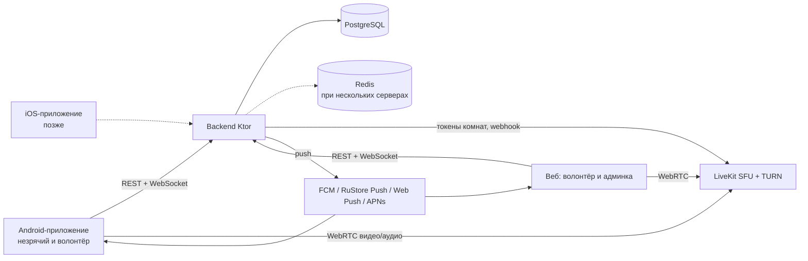
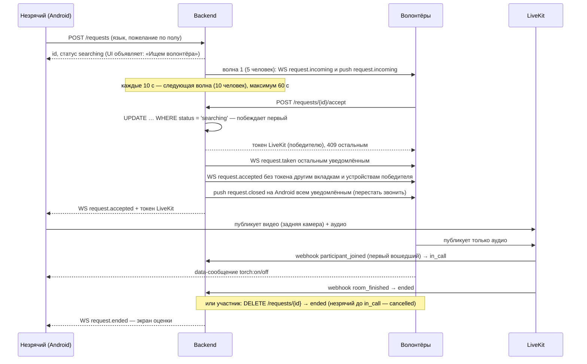

# Архитектура MVP «Рядом» — видеопомощь незрячим

> Рабочее название «Рядом» (пакет `ru.ryadom`) — заменить, когда появится финальное.
> Версия документа: 05.10.2026. Источник истины для разработки вместе с `docs/api/openapi.yaml`.

## 1. Ключевые решения

| Область | Решение | Почему |
|---|---|---|
| Мобильное приложение | Сейчас Android (Kotlin + Jetpack Compose); iOS (SwiftUI) — после отладки на Android | Kotlin — ваш язык; нативный UI лучше всего работает с TalkBack и VoiceOver |
| Общая логика | Модуль `shared` на Kotlin Multiplatform: API, WebSocket, авторизация, состояния запроса и звонка | При переносе на iOS заново пишутся только экраны и видеочасть |
| Бэкенд | Kotlin + Ktor | Один язык с Android, общий опыт |
| Веб | React + TypeScript (Vite): простая страница волонтёра и админка | Второй конец звонка для тестов; вход для волонтёров с iPhone до iOS-приложения |
| Видео | LiveKit (open-source SFU) на своём сервере, встроенный TURN | Нет зависимости от иностранных сервисов; SDK для Android, JS и Kotlin-сервера |
| База данных | PostgreSQL + Flyway-миграции | Надёжно и привычно |
| Очередь и блокировки | PostgreSQL + память backend; Redis — позже | «Кто первый принял звонок» — атомарный `UPDATE … WHERE status = 'searching'` в той же транзакции, что и остальные изменения; онлайн-статусы — открытые WebSocket в памяти (сервер backend один). Redis понадобится, когда серверов backend станет несколько (решено на этапе 2); тогда же сравнить его с PostgreSQL `LISTEN/NOTIFY` — шина событий без нового компонента (раздел 13) |
| Push | FCM (Android), Web Push (браузер), APNs + VoIP-push (iOS, позже); RuStore Push — на сервере есть, в приложении отложен | Отправка через общий интерфейс — новый канал добавляется без изменения логики. В уведомлении только вид события и id запроса: оно идёт через сервисы Google, VK и браузеров (решено на этапе 5). Приложение пока регистрирует только FCM: для RuStore Push нужен аккаунт разработчика RuStore с проверкой личности, его заведём при публикации в RuStore (решено перед этапом 6, раздел 7). Адрес устройства в FCM — Firebase Installation ID, а не устаревший с 2026 года токен регистрации (решено на этапе 6) |
| Вход | Яндекс ID и VK ID (OAuth); вход по телефону — после появления юрлица | Не нужны договоры с SMS-провайдерами на старте |
| Языки | Русский и английский | Все строки только через ресурсы |
| Хостинг | Yandex Cloud, Docker Compose на 2 ВМ | Данные в РФ (152-ФЗ), просто для одного разработчика |
| Код | Открытый, монорепозиторий на GitHub + зеркало на GitFlic/GitVerse | Гранты, волонтёры-разработчики, защита от блокировок |
| Распространение | APK с сайта и RuStore; Google Play позже | Публикации пока нет — начинаем с APK |

## 2. Компоненты

Весь медиатрафик идёт через LiveKit на нашем сервере. Звонки не записываются.

## 3. Сценарий звонка

Звонок считается начавшимся (`in_call`), когда в комнату LiveKit вошёл первый участник — обычно незрячий, раньше волонтёра. Если незрячий завершает запрос до этого, запрос становится `cancelled` (волонтёру приходит `request.cancelled`, незрячему событие не нужно), после — `ended` (оба получают `request.ended`).

## 4. Подбор волонтёра

Кандидаты для запроса:

- роль «волонтёр», не заблокирован, уведомления включены;
- говорит на языке запроса;
- подходит по полу, если незрячий указал пожелание;
- по его часовому поясу сейчас 08:00–22:00 (или своё окно «не беспокоить»);
- не находится в звонке, ещё не получал вызов по этому запросу и не является его автором;
- очерёдность: кого дольше всего не беспокоили (последний вызов по любому запросу или конец его звонка), при равенстве — случайно.

Жёсткой паузы между вызовами одному волонтёру нет (решено на этапе 2). Пока волонтёров мало, пауза отсекала бы почти всех: в первой волне 5 человек, один принимает вызов, а остальные четверо выпадали бы на 10 минут, и повторный запрос незрячего не доходил бы ни до кого. Нагрузку распределяет очерёдность: недавно побеспокоенный волонтёр попадает в волну, только если остальных подходящих не хватает.

Волны: сразу 5 человек, далее каждые 10 секунд по 10, всего до 60 секунд. Если никто не принял, статус `no_answer`, незрячему объявляется «Сейчас никто не ответил, попробуйте ещё раз». Все параметры (размер волн, интервалы, окно) задаются в конфиге, а не в коде (`backend/src/main/resources/application.conf`, разделы `matching`, `requests`, `profile.defaultDoNotDisturb`).

Ограничения: у незрячего одновременно не больше одного активного запроса, у волонтёра — не больше одного звонка (гарантируют уникальные индексы в базе); частота запросов ограничена от злоупотреблений (по умолчанию 20 в час).

Повторные пары (волонтёр снова попадает к тому же незрячему) пока разрешены: волонтёров мало, и запрет оставлял бы незрячих без помощи. Такие звонки попадают в отчёт для администратора (этап 8); запрет — когда волонтёров станет достаточно (раздел 9 и «Отложенные задачи»).

Как устроено (этап 2):

- правила отбора и очерёдность — чистая функция `VolunteerMatcher` с unit-тестами;
- волны отправляет `RequestDispatcher`: раз в секунду проверяет идущие поиски. Номер следующей волны хранится в базе (`help_requests.next_wave`), поэтому после перезапуска сервера поиск продолжается. Если волны пропущены, пока сервер был выключен, уходит только последняя из них, а время поиска считается от создания запроса, включая простой;
- кандидаты — волонтёры, до которых дойдёт вызов: с открытым WebSocket или с устройством (`devices`) в канале push, настроенном на сервере (устройство с токеном FCM при сервере без FCM место в волне не займёт). Выбранным уходит и событие WebSocket, и push на все их устройства (этап 5);
- роль нельзя сменить, пока у пользователя есть активный запрос или идёт звонок (`PATCH /me` отвечает 409);
- push (этап 5, код — `backend/.../push`): отправители каналов реализуют общий интерфейс `PushSender` (`WebPushSender`, `FcmSender`, `RuStoreSender`, в тестах — `FakePush`), рассылкой занимается `PushNotifier`. Отправка идёт в фоне и не задерживает волну; устройство, которое push-сервис больше не знает (404/410 Web Push, `UNREGISTERED` FCM, `NOT_FOUND` RuStore), удаляется. FCM адресуется по FID (`message.fid`, этап 6). Канал без настроек (переменных окружения) выключен. Push-сервис хранит вызов, пока идёт поиск (TTL — сколько осталось до `matching.searchTimeout`, не меньше 10 секунд): телефон, вернувшийся в сеть позже, о закрытом вызове не зазвонит;
- «вызов больше не ждёт ответа» (`request.closed` — принят, отменён, никто не ответил) уходит push только на Android, чтобы вызов перестал звонить, в том числе на других устройствах принявшего. Браузерам — нет: на каждое Web Push сайт обязан показать уведомление (Safari после трёх «молчаливых» push отзывает подписку, Firefox — после шестнадцати), а показывать «вызов закрыт» незачем; открытый сайт убирает вызов по событию WebSocket;
- `GET /requests/incoming` — вызовы, которые ждут ответа волонтёра (поиск идёт, вызов приходил, волонтёр не отвечал). Клиент перечитывает его после каждого подключения WebSocket и при нажатии на уведомление: вызов, пришедший во время обрыва связи, не теряется (решено на этапе 5);
- страховка: звонок, о завершении которого LiveKit не сообщил, закрывается через 3 часа (`requests.maxCallDuration`). Запрос, в комнату звонка которого после принятия никто не вошёл (приложения упали, пропала сеть), закрывается как `ended` через 2 минуты (`requests.joinTimeout`, решено на этапе 4): LiveKit не создаёт комнату без участников и о таком звонке не сообщит, а пока запрос активен, волонтёр не получает вызовов, а незрячий не может попросить помощи снова.

## 5. Модель данных

Данные о здоровье и инвалидности не собираются. Роль выбирает сам пользователь.
Схема создаётся миграциями Flyway (`backend/src/main/resources/db/migration`) по этапам: на этапе 1 — `users`, `auth_identities`, `refresh_tokens`; на этапе 2 — `help_requests`, `request_notifications`, `ratings`; на этапе 5 — `devices`; остальные таблицы — в этапах, где они нужны.

«Не указано» хранится как NULL: `gender` NULL — пол не указан (`unspecified` в API), `gender_preference` NULL — подойдёт любой (`any`), `dnd_from`/`dnd_to` NULL — окно из конфига `profile.defaultDoNotDisturb` (сменили конфиг — окно поменялось у всех, кто не задал своё; `GET /me` всегда отдаёт конкретные часы). Новый пользователь получает язык и часовой пояс из конфига (`profile.defaultLanguage` — `ru`, `profile.defaultTimezone` — `Europe/Moscow`) и включённые вызовы; при выборе роли web и Android сохраняют часовой пояс устройства (если сервер такого пояса не знает — роль сохраняется без него).

| Таблица | Основные поля |
|---|---|
| `users` | id, role (`blind`/`volunteer`/`admin`; NULL — ещё не выбрана), display_name, languages[], gender (необязательно), gender_preference (для незрячего), timezone, dnd_from, dnd_to, notifications_enabled, banned_at, created_at |
| `auth_identities` | id, user_id, provider (`yandex`/`vk`/`dev`), subject, created_at |
| `devices` | id, user_id, push_provider (`fcm`/`rustore`/`webpush`; `apns`/`apns_voip` — этап 11), token (у Web Push — адрес подписки), webpush_p256dh и webpush_auth (ключи шифрования Web Push), created_at, updated_at. Один токен — одно устройство: при входе под другим пользователем в том же браузере оно переходит к нему. У пользователя не больше `push.maxDevicesPerUser` (10) устройств, лишние — самые давние — удаляются. Поле `platform` из первоначального плана не понадобилось: платформу задаёт канал |
| `help_requests` | id, blind_user_id, language, gender_preference, status (`searching`/`accepted`/`in_call`/`ended`/`no_answer`/`cancelled`), accepted_by, next_wave, created_at, accepted_at, ended_at |
| `request_notifications` | request_id, volunteer_id, wave, sent_at, result (`accepted`/`too_late`; NULL — не ответил) |
| `ratings` | request_id, from_user_id, helped («помогло/не помогло» — проще всего с TalkBack), created_at. Без текстового комментария: в нём могли бы оказаться данные о здоровье; жалобы — в `reports` |
| `reports` | id, request_id, from_user_id, against_user_id, reason, text, status, resolved_by, created_at |
| `refresh_tokens` | id, user_id, token_hash (SHA-256, сам токен не хранится), created_at, expires_at, revoked_at |

## 6. API (кратко; полная версия — `docs/api/openapi.yaml`)

REST, JSON, авторизация по JWT (access 15 мин + refresh 90 дней с ротацией: повторное использование старого refresh-токена отзывает все сессии пользователя). Ошибки — в едином формате `{code, message}`: клиент показывает текст по `code` из своих ресурсов.

Методы, которых ещё нет в коде, помечены этапом, в котором они появятся.

| Метод | Путь | Назначение |
|---|---|---|
| GET | `/health` | Сервер работает — для проверок развёртывания |
| POST | `/auth/oauth/{provider}` | Вход через Яндекс ID; VK ID — этап 7 |
| POST | `/auth/dev` | Вход без OAuth — только в dev-окружении |
| POST | `/auth/refresh` | Обновление пары токенов (старый refresh-токен становится недействительным) |
| POST | `/auth/logout` | Выход на устройстве (отзыв refresh-токена) |
| GET / PATCH | `/me` | Профиль, роль, языки, пол, окно «не беспокоить» |
| POST | `/devices` | Регистрация устройства для push (FCM — Firebase Installation ID) или подписки Web Push; повторная безопасна |
| DELETE | `/devices/{id}` | Выключить push на устройстве (перед выходом) |
| GET | `/push/config` | Открытый ключ VAPID для подписки браузера на Web Push |
| POST | `/requests` | Незрячий просит помощи |
| GET | `/requests/current` | Текущий активный запрос или звонок — восстановление после перезапуска приложения |
| GET | `/requests/incoming` | Вызовы, которые ждут ответа волонтёра, — после переподключения и при нажатии на уведомление |
| GET | `/requests/{id}` | Состояние запроса — после переподключения WebSocket |
| DELETE | `/requests/{id}` | Незрячий отменяет поиск или завершает звонок; волонтёр завершает звонок (с этапа 3: иначе звонок, из которого ушёл только волонтёр, оставался бы открытым до выхода незрячего) |
| POST | `/requests/{id}/accept` | Волонтёр принимает; ответ — URL и токен LiveKit |
| POST | `/requests/{id}/rating` | Оценка после звонка: помогло / не помогло |
| POST | `/reports` | Жалоба (этап 8) |
| POST | `/webhooks/livekit` | События комнат от LiveKit |
| GET | `/admin/reports`, `/admin/metrics` | Админка (этап 8) |
| POST | `/admin/users/{id}/ban` | Блокировка (этап 8) |

Push-уведомление (схема `PushMessage` в `openapi.yaml`): `{type, requestId}`, где `type` — `request.incoming` (новый вызов) или `request.closed` (вызов больше не ждёт ответа, только Android). Остальное клиент узнаёт через API; неизвестный `type` пропускает.

WebSocket `/ws` — события: `request.incoming` (волонтёру — новый вызов), `request.accepted` (незрячему — с данными для звонка; всем соединениям принявшего волонтёра — без них, чтобы вызов перестал звонить в его других вкладках и на других устройствах), `request.no_answer`, `request.cancelled`, `request.taken` (для волонтёров, звонок уже принят), `request.ended` (звонок завершён). Каждое событие содержит актуальное состояние запроса. Вход — первым сообщением `{"type":"auth","accessToken":…}`, потому что браузер не передаёт заголовок `Authorization` при открытии WebSocket; после обновления токенов клиент присылает `auth` ещё раз. Пропущенные без соединения события не повторяются: клиент перечитывает состояние через `GET /requests/...`.

Подробности WebSocket (полностью — описание `/ws` в `openapi.yaml`): сервер раз в 30 секунд проверяет соединение (ping) и отключает пропавших клиентов; у пользователя может быть несколько соединений (вкладки, устройства), события приходят во все. Коды закрытия: `4401` — клиент обновляет токены и сразу переподключается, `4403` — пользователь заблокирован, клиент завершает сеанс.

Совместимость версий. Сервер обновляется сразу, а приложения — когда пользователь поставит новый APK, поэтому старые версии работают долго. Отсюда правила:

- сервер строго проверяет тела запросов: неизвестное поле — ошибка 400, чтобы опечатки в клиенте были видны сразу. Сообщения клиента в WebSocket разбираются мягче: неизвестные поля и типы сообщений пропускаются;
- клиенты, наоборот, игнорируют неизвестные поля в ответах, неизвестные события WebSocket и неизвестные коды ошибок (показывают общее сообщение);
- поля в ответах только добавляются; поля запросов не удаляются и не переименовываются, новые поля запросов — необязательные;
- новое значение перечисления в ответе (статус, роль) старый клиент разобрать не сможет: сначала клиенты должны научиться пропускать неизвестные значения, иначе — новое поле.

## 7. Android-приложение

- Одно приложение, две роли; роль выбирается при первом входе.
- minSdk 26 (Android 8): у незрячих часто недорогие и не новые телефоны.
- Модули: `shared` (Kotlin Multiplatform — см. ниже), `android/app`, `feature-help` (незрячий), `feature-volunteer` (волонтёр, этап 6), `feature-call` (LiveKit), `core-ui` (тема и доступные компоненты), `testing` (проверки доступности для тестов).
- `shared` содержит: модели API, клиент Ktor + WebSocket, интерфейс хранения токенов, машину состояний запроса («поиск → принят → звонок → оценка»), коды ошибок. В `shared` запрещены зависимости от Android и от LiveKit: видео и UI остаются в платформенном коде.
- Экраны Android только отображают состояния контроллеров из `shared`; бизнес-логики в UI нет.
- Экран незрячего: одна большая кнопка на весь экран, вибрация и голосовые объявления при каждом изменении статуса.
- Звонок: foreground service (типы camera + microphone), экран не гаснет, задняя камера по умолчанию.
- Волонтёр: входящий вызов — high-priority push и полноэкранное уведомление в стиле звонка (этап 6, ниже).
- Фонарик: команда от волонтёра через data-канал LiveKit. **Риск:** проверить на прототипе, что фонарик включается, пока камера захвачена LiveKit.

Правила доступности (обязательны для каждого экрана):

- у каждого интерактивного элемента есть осмысленное описание для TalkBack;
- зона нажатия не меньше 48×48 dp, основная кнопка — на весь экран;
- изменения статуса объявляются (`liveRegion` / announce), а не только показываются;
- поддержка крупного шрифта и высокой контрастности, без информации «только цветом»;
- логичный порядок фокуса, никаких таймаутов, требующих быстрой реакции.

Как устроено (этап 4):

- `shared`: `ApiClient` (Ktor; движок HTTP передаёт платформа — на Android OkHttp), `RealtimeConnection` (WebSocket с переподключением и повторным `auth`, как в web), `AuthController` (вход, выбор и смена роли, выход) и `BlindHelpController` (запрос, поиск, звонок, оценка).
- WebSocket клиент проверяет пингом раз в 20 секунд (`RealtimeConnection.PING_INTERVAL_MS`; OkHttp пингует сам, поэтому интервал задан и в настройках движка в `AppContainer`): без этого оборванное соединение выглядело бы живым, и событие «волонтёр найден» потерялось бы. При смене сети (Wi-Fi → мобильная) соединение обрывается и сразу открывается заново — старое могло остаться в прежней сети (решено на этапе 4). Когда появилась сеть, экран «Нет связи» при запуске (профиль не загрузился) тоже сам повторяет загрузку: незрячему не нужно искать кнопку «Повторить». Переходы между экранами незрячего — чистые функции в `BlindHelpState.kt` с тестами. Контроллеры работают в главном потоке, состояние — `StateFlow`.
- Хранение токенов и звонок — интерфейсы в `shared` (`SessionStorage`, `CallSession`/`CallFactory`), реализации — на платформе. На Android токены шифруются ключом из Android Keystore (`KeystoreSessionStorage`; если сохранить не удалось, прежние токены удаляются с диска — иначе после перезапуска сервер принял бы использованный refresh-токен за кражу и завершил бы все сеансы), звонок — LiveKit (`feature-call`). Вместо `expect/actual` — интерфейсы: на iOS (этап 11) их реализует Swift (Keychain, LiveKit Swift SDK), и общий код легко тестировать с поддельными реализациями.
- Контроллеры живут в `AppContainer`, пока жив процесс: звонок не прерывается при повороте экрана и уходе приложения в фон. Foreground service (`feature-call`, типы camera и microphone) работает от начала поиска до конца звонка — так приложение не останавливается и при выключенном экране. Вибрация при смене статуса — там же, а не в экране: при каждом изменении строки состояния (решено на этапе 4). Два толчка — волонтёр найден или появился в звонке; долгая вибрация — поиск или звонок закончились, волонтёр пропал, звонок прервался; короткий толчок — остальное. Без вибрации — восстановление после перезапуска и случаи, когда строка опустела (сказать нечего).
- Foreground service запускается, только когда приложение на экране и выдано разрешение на камеру или микрофон (ограничения Android 12+ и 14+); иначе поиск и звонок идут без него. Уведомление тихое; если система всё же остановила приложение, сервис не перезапускается (`START_NOT_STICKY`).
- Решения из этапа 3: если волонтёр завершил звонок раньше, чем подключился (`request.ended`, а в комнате его не было), незрячему не задаётся вопрос об оценке — предлагается позвать помощь снова. Если волонтёр пропал из комнаты LiveKit без завершения, приложение объявляет об этом и предлагает подождать или завершить звонок. Ночью (22:00–08:00 по времени телефона — окно «не беспокоить» по умолчанию) текст «никто не ответил» объясняет, что ночью волонтёров мало.
- Незрячий завершает звонок: камера и микрофон выключаются сразу, `DELETE /requests/{id}` повторяется, пока не будет связи, — иначе запрос остался бы активным и попросить помощи снова было бы нельзя. Если сервер отказал не из-за сети, повтор не поможет, и звонок у незрячего считается законченным. Если запрос на сервере всё же остался открытым, следующее «Позвать волонтёра» получает `active_request_exists`, завершает этот запрос ещё раз и начинает новый поиск; если сервер снова отказал — объявляет ошибку. В тот звонок приложение не возвращает: незрячий мог завершить его, уходя от неподходящего волонтёра (раздел 9). Активный запрос, созданный до перезапуска или на другом устройстве, кнопка показывает.
- Кнопка «Завершить звонок» — высотой 120 dp, а не на весь экран (решено на этапе 4): незрячий держит телефон и наводит камеру, и случайное касание не должно обрывать звонок. «На весь экран» — главная кнопка «Позвать волонтёра».
- Разрешения на камеру и микрофон спрашиваются при первом нажатии «Позвать волонтёра»; если отказано — объяснение и кнопка «Открыть настройки». На Android 13+ там же — разрешение на уведомления (`POST_NOTIFICATIONS`, этап 5): без него уведомление о поиске и звонке не видно в шторке. Отказ в нём звонку не мешает и не объявляется.
- Приложение регистрирует только FCM, без RuStore Push (решено перед этапом 6). Для RuStore Push нужен аккаунт разработчика RuStore (вход через VK ID, проверка личности по паспорту) и проект на каждый ключ подписи. При этом push нужен только волонтёрам: незрячий сам начинает звонок, а волонтёр — зрячий человек и может помогать с компьютера через сайт. Без сервисов Google (в основном телефоны Huawei последних лет) FCM не работает: на таком телефоне приложение говорит волонтёру, что вызовы приходят, только пока приложение открыто, и что помогать можно через сайт. Сервер RuStore Push уже умеет (этап 5), в приложение он добавляется при публикации в RuStore — аккаунт тогда понадобится всё равно — или раньше, если таких волонтёров станет много или FCM в России начнёт работать с перебоями (раздел 13, «Отложенные задачи»).
- Объявления голосом — строка состояния вверху экрана (live region, одна на все состояния незрячего), ошибки объявляются сразу (assertive). Второй live region рядом TalkBack может пропустить, поэтому в строку состояния собирается всё, что нужно объявить: статус запроса или звонка, нет доступа к камере или микрофону, микрофон выключен, разрешения не выданы, нет связи с сервером. Нет доступа к камере или микрофону — срочное объявление и кнопка «Открыть настройки» в звонке; когда пользователь вернётся в приложение, камера и микрофон включаются снова (`CallSession.retryBlockedDevices`).
- Вход: Яндекс LoginSDK (кнопка есть, если в сборке задан `ryadom.yandexClientId`) и вход по логину только в debug-сборке.
- Внизу кабинета волонтёра — «Мне нужна помощь»: смена роли (`AuthController.changeRole`). Без неё незрячий, по ошибке нажавший «Я хочу помогать», не смог бы попросить помощи: повторный вход роль не сбрасывает (решено на этапе 4). Сменить роль нельзя, пока есть активный запрос или звонок. Для администратора в приложении экранов нет — оно отправляет на сайт.

Как устроено (этап 6, волонтёр):

- `shared`: `VolunteerController` (вызовы, принятие, звонок, оценка, «Готов помогать») и чистые функции переходов `VolunteerState.kt` — те же правила и случаи тестов, что у кабинета на сайте (`web/src/volunteer/volunteerState.ts`). `PushRegistration` сообщает серверу адрес устройства (`POST /devices`) при каждом запуске и при каждом новом адресе, без связи повторяет с растущими паузами и удаляет устройство перед выходом. Задачи «перед выходом» — `ApiClient.onBeforeLogout`, как на сайте: завершить идущий звонок и удалить устройство, пока вход ещё действует; каждая ждёт не дольше 5 секунд.
- `feature-volunteer`: экраны (`VolunteerScreen`), `VolunteerRoute` (разрешения, окно звонка), `VolunteerSideEffects` (то, что работает без экрана), `IncomingCallNotifications`. Решений о вызовах в Android-коде нет — только как показать и чем позвонить.
- Как вызов доходит до волонтёра. Приложение на экране — событие WebSocket, звонит само приложение (`Ringer`: мелодия звонка телефона по кругу и вибрация; режимы «Без звука» и «Вибрация» соблюдаются), вызов объявляется срочно. Приложение в фоне — уведомление о вызове: из события WebSocket, пока процесс жив (так вызовы доходят и до телефонов без сервисов Google), или из push FCM, который поднимает и закрытое приложение. По push уведомление показывается сразу, ещё до загрузки экранов, а затем контроллер сверяет вызовы с сервером (`GET /requests/incoming`). Уведомление убирается, когда вызов исчез из списка, после сверки, по push `request.closed` и само через 2 минуты; когда приложение на экране или идёт звонок, уведомлений о вызовах нет.
- Уведомление — в стиле звонка (`NotificationCompat.CallStyle`, кнопки «Ответить» и «Отклонить» с системными подписями), канал высокой важности со звуком звонка, звонит, пока его не уберут (`FLAG_INSISTENT`), видно на экране блокировки — данных о незрячем в нём нет. На заблокированном телефоне оно открывает приложение на весь экран (full-screen intent): Activity показывается поверх блокировки и включает экран (`setShowWhenLocked`, `setTurnScreenOn`), пока вызов звонит или идёт звонок, а после открытия из уведомления — до первой сверки с сервером. С Android 14 полноэкранный показ — отдельное разрешение (Google Play даёт его только звонилкам, пользователь может его отозвать): без него вызов приходит всплывающим уведомлением, а кабинет предлагает разрешить. Оформление звонка без полноэкранного показа Android отклоняет — тогда обычное уведомление с теми же кнопками.
- «Ответить» открывает приложение и принимает вызов (если экран ещё загружается — `AppContainer.pendingAccept`), «Отклонить» или смахивание — «Пропустить» только на этом телефоне, как на сайте.
- FCM: адрес устройства — Firebase Installation ID из `FirebaseMessagingService.onRegistered` (токен регистрации и `onNewToken` с 2026 года устарели; сервер шлёт `message.fid`). Регистрация в FCM — только когда вошёл волонтёр (`firebase_messaging_auto_init_enabled=false`, `FirebaseMessaging.register()`): телефон незрячего в FCM не нужен. Когда сеанс закончился (выход, истёк, блокировка), телефон отписывается (`unregister()`): даже если удалить устройство на сервере не удалось, FCM ответит серверу `UNREGISTERED`, и сервер удалит его сам. Firebase запускается из кода по настройкам сборки `ryadom.firebase.*` (README), без `google-services.json` в репозитории и без Google Analytics. Нет настроек или сервисов Google (`GoogleApiAvailability`) — кабинет объясняет, что вызовы приходят, только пока приложение открыто, и что помогать можно через сайт.
- Разрешения: кабинет объясняет, зачем микрофон и уведомления, и спрашивает их по кнопке; после отказа — одна кнопка «Открыть настройки». «Принять» без разрешения на микрофон сначала спрашивает его; без микрофона вызов не принимается — незрячий волонтёра не услышит.
- Звонок волонтёра: только звук; видео незрячего — кадр целиком, с полями. Если задать элементу видео точный размер, WebRTC обрезает кадр под его форму, а волонтёру нужно видеть весь документ (найдено при проверке на эмуляторе, этап 6). Экран не гаснет, снимки и запись экрана запрещены (`FLAG_SECURE` на время звонка; проверено: снимок экрана чёрный, а ATF на эмуляторе контраст в таком окне проверяет), foreground service с типом microphone. Волонтёр завершает звонок, как незрячий: звук выключается сразу, `DELETE /requests/{id}` повторяется, пока нет связи.
- Время тишины показывается по часовому поясу профиля (и что сейчас тишина), меняется пока на сайте. «Готов помогать» — переключатель `SwitchRow` из `core-ui`: вся строка — зона нажатия, TalkBack читает состояние.

## 8. Веб-приложение

Простое приложение без лишних функций: инструмент тестирования и вход для волонтёров с iPhone, пока нет iOS-версии.

- Волонтёр: вход, переключатель «готов помогать», входящие запросы (WebSocket, пока вкладка открыта, + Web Push), принятие, окно видео, кнопка фонарика, завершение, жалоба.
- Админ: жалобы, блокировки, метрики (время ответа, доля `no_answer`, число звонков и длительность по дням).
- Незрячих в веб-версии нет.
- На каждой странице — ссылка на исходный код (требование лицензии AGPL).

Как устроено (этап 3, код — `web/src`):

- Сайт и API на одном адресе: запросы идут на `/api/...`, в разработке их пересылает на backend Vite (`web/vite.config.ts`), на сервере — Caddy. Поэтому CORS не нужен.
- Модели API продублированы на TypeScript (`web/src/api/types.ts`, модуль `shared` из браузера не используется). Разбор ответов не ломается на новом сервере: неизвестные поля пропускаются, неизвестная роль или статус становятся `unknown`, неизвестный язык показывается как «другой», неизвестные события WebSocket и коды ошибок — общий случай (раздел 6).
- Токены — в `localStorage`, общие для вкладок: вход переживает перезагрузку, а уведомление Web Push откроет сайт уже вошедшим. Если браузер запретил сайту хранилище, `localStorage` и `sessionStorage` заменяет хранилище в памяти (`services.ts`): сайт открывается, вход живёт до перезагрузки страницы, а вход через Яндекс не завершится. Обновление токенов — под блокировкой Web Locks, общей для всех вкладок: refresh-токен одноразовый, и два одновременных обновления сервер принял бы за кражу и отозвал бы все сеансы. Где Web Locks нет (старые браузеры), обновления выстраиваются в очередь только внутри вкладки.
- Сеанс: access-токен обновляется заранее, если до истечения меньше 30 секунд; на ответ 401 — одно обновление и повтор запроса. Сеанс заканчивается по трём причинам — истёк, заблокирован, вышел, — у каждой своё сообщение. Выход в одной вкладке завершает сеанс во всех, вход под другим пользователем в другой вкладке перечитывает профиль и сбрасывает экраны. Ответ 5xx без тела в формате API (так отвечает прокси, когда backend выключен) показывается как «нет связи».
- WebSocket сам переподключается (паузы 1–30 с, каждая случайно короче до четверти — после перезапуска сервера клиенты не приходят обратно в одну секунду, так же в `shared`, этап 6; при закрытии с кодом 4401 и при появлении сети — сразу), до истечения access-токена присылает новый `auth`, а после каждого `ready` клиент перечитывает через REST текущий звонок и вызовы, которые ждут ответа (`GET /requests/incoming`): вызов, пришедший во время обрыва связи, появляется и звонит, закрытый — исчезает. Вызов, пропущенный в этой вкладке, список не возвращает.
- Web Push (этап 5, код — `web/src/push`). Service Worker (`serviceWorker.ts`) собирается отдельно в один файл `/sw.js` без `import` (`vite.pwa.ts`; в `npm run dev` — по запросу): так он работает и в браузерах без Service Worker-модулей. Страниц он не кэширует. На каждый push «новый вызов» показывает уведомление — даже если сайт открыт (тогда без звука: страница звонит сама), иначе Safari отзывает подписку. Уведомление закрывается, когда вызов исчез со страницы; уведомления старше двух минут Service Worker убирает сам. Нажатие показывает открытую вкладку сайта (и та перечитывает вызовы) или открывает новую.
- Панель «Уведомления о вызовах» в кабинете: подписка — по нажатию «Включить уведомления», прямо в обработчике нажатия (ключ сервера загружается заранее, `GET /push/config`): Safari и Firefox спрашивают разрешение только в ответ на действие пользователя. Подписка браузера заново регистрируется на сервере при каждом открытии кабинета; подписка со старым ключом сервера удаляется. При выходе подписка удаляется и на сервере, и в браузере — вышедшему волонтёру вызовы не приходят. Если браузер запретил уведомления, не умеет Web Push или сервер не знает его push-сервис — объяснение вместо кнопки. Без Web Push на сервере панели нет.
- Ограничения Web Push, о которых говорит панель (проверено на этапе 5): на компьютере уведомления приходят, только пока браузер запущен — закрыть можно вкладку, но не сам браузер (на телефоне — и при закрытом браузере), поэтому кабинет советует включить уведомления и на телефоне. Brave по умолчанию выключает push-сервис Google, без которого Web Push в нём не работает: если подписаться не удалось, кабинет подсказывает включить «Use Google services for push messaging» в `brave://settings/privacy`.
- iPhone и iPad: Web Push работает только у сайта, добавленного на экран «Домой» (iOS 16.4+). Для этого — манифест веб-приложения (`display: standalone`) на языке браузера (`/manifest-ru.webmanifest`, `/manifest-en.webmanifest`, собирает `vite.pwa.ts` из `src/manifest.ts`) и иконки в `web/public` (временные, рисует `web/scripts/generate-icons.mjs`). В обычной вкладке Safari кабинет объясняет, как добавить сайт на экран «Домой».
- Логика кабинета волонтёра — чистая функция `volunteerReducer` с тестами; экраны только отображают её состояние. Звонок — интерфейс `CallSession`, реализация на LiveKit загружается только при первом звонке (самая большая часть сайта).
- Волонтёр завершает звонок сам (`DELETE /requests/{id}`). Событие `request.ended` может прийти раньше ответа на `DELETE`, поэтому кабинет заранее отмечает, что звонок завершает сам волонтёр, — иначе он услышал бы «Собеседник завершил звонок». Вопрос «Удалось помочь?» — только если собеседник хоть раз был в комнате, как на Android (раздел 7); если незрячий отменил вызов или не подключился — сообщение «Звонок не состоялся». Выход во время звонка сначала завершает звонок этой вкладки (`ApiClient.onBeforeLogout`), иначе он остался бы открытым на сервере. Принятый вызов перестаёт звонить в других вкладках и на других устройствах волонтёра: сервер шлёт им `request.accepted` без данных для звонка (раздел 6). Входящий вызов: звук (Web Audio), заголовок вкладки, срочное объявление для экранного диктора. Звук браузер разрешает только после действия пользователя: если после загрузки страницы не было нажатий, вызов придёт без звука — для этого на главной кнопка «Проверить звук». «Пропустить» скрывает вызов только в этой вкладке, сервер о нём не знает. Во время звонка закрытие вкладки браузер переспрашивает.
- «Готов помогать» — поле профиля `notificationsEnabled`. Время тишины показывается и меняется на главной странице; при выборе роли сохраняется часовой пояс браузера.
- Роль меняется в обе стороны: внизу кабинета волонтёра — «Мне нужна помощь» (если роль волонтёра выбрана по ошибке), незрячему сайт объясняет, что просить помощи нужно в Android-приложении, и предлагает «Стать волонтёром».
- Доступность: статусы объявляются через `aria-live` (в том числе потеря и восстановление связи с сервером: без неё вызовы не приходят), при смене экрана фокус переходит на его заголовок, кнопки от 48 px, у состояний есть текст, а не только цвет, светлая и тёмная темы.
- Для разработки (`npm run dev`) — вход без OAuth и страница «тестовый незрячий»: создаёт запрос и публикует камеру компьютера, чтобы проверить звонок без Android-приложения. В собранном сайте их код есть, но они выключены (`config.devTools`); включает их переменная сборки `VITE_DEV_TOOLS=true` — для тестового сервера. Вход без OAuth работает, только если его разрешает и сервер (`AUTH_DEV_ENABLED`).

## 9. Безопасность и персональные данные

- Все серверы и данные — в Yandex Cloud (РФ).
- Не храним: видео, аудио, данные о здоровье, точную геолокацию.
- Логи без персональных данных (только id).
- Токены LiveKit выдаются на одну комнату и живут не дольше 2 часов.
- Вход через Яндекс ID: веб получает код авторизации (с PKCE) и передаёт его серверу, сервер сам обменивает код на токен Яндекса. Android получает токен через Яндекс LoginSDK, сервер проверяет по `login.yandex.ru/info`, что токен выдан нашему `client_id` (иначе подошёл бы токен любого сайта с входом через Яндекс). От Яндекса сохраняются только id пользователя и имя; токены Яндекса не хранятся.
- На сайте `state` и `code_verifier` входа через Яндекс хранятся в `sessionStorage`: вход завершается только в той вкладке, где начат, а параметры ответа Яндекса сразу убираются из адреса, чтобы код не остался в истории браузера. Браузер даёт PKCE (`crypto.subtle`), камеру и микрофон только по HTTPS или на `localhost`: с телефона по адресу `http://192.168…` сайт не войдёт и не позвонит.
- Имя пользователя передаётся в токен LiveKit — его видит собеседник в звонке.
- Push-уведомления идут через внешние сервисы (Google, VK, компании-разработчики браузеров), поэтому в них только вид события и id запроса, без имён и данных о людях. Web Push к тому же зашифрован для браузера (RFC 8291) и подписан ключом сервера (VAPID, RFC 8292); ключи — в переменных окружения. В логах — только id устройств, без токенов и адресов подписок.
- Адрес подписки Web Push присылает браузер, а запрос по нему делает сервер, поэтому принимаются только `https://` адреса известных push-сервисов браузеров на стандартном порту (`push.webPush.allowedHosts`), и HTTP-клиент push не переходит по редиректам — иначе сервер можно было бы заставить слать запросы во внутреннюю сеть.
- Android: бэкап данных приложения выключен (`allowBackup=false`, `data_extraction_rules` исключают всё) — токены не попадают в облачную копию и на другой телефон. HTTP без TLS разрешён только в debug-сборке (`android/app/src/debug`), в release — только HTTPS.
- Вход без OAuth (`POST /auth/dev`) включается только переменной `AUTH_DEV_ENABLED=true` — для разработки и тестов.
- Секреты — только в переменных окружения и секретах CI, никогда в репозитории.
- При регистрации — согласие на обработку ПДн и ссылка на политику.

### Защита незрячих от мошенников и злоупотреблений

Решено на этапе 4. Главный риск — не сервер (он ничего не записывает), а волонтёр. Незнакомый человек видит всё, что попало в кадр: карту, паспорт, конверт с адресом, экран телефона с кодом из SMS. Он может обмануть («прочитайте код», «я из банка») и записать звонок своими средствами — на сайте это не запретить. Незрячий же не видит, что попало в кадр.

Что уже есть и должно сохраниться:

- волонтёр знает только имя незрячего, без фамилии и контактов: имя (от Яндекс ID — только `first_name`) приходит в токене LiveKit, чтобы к человеку можно было обратиться; в `HelpRequest` данных собеседника нет;
- собеседника нельзя выбрать или позвать напрямую — только волны случайных подходящих волонтёров (раздел 4);
- видео передаёт только незрячий, волонтёр — только звук.

Что добавляется (задачи — раздел 13, «Отложенные задачи»):

- голосовой инструктаж незрячего при первом входе и напоминание время от времени (этап 10);
- в звонке у незрячего — кнопки «Скрыть видео» (камера на паузе, звук остаётся; этап 7) и «Пожаловаться и завершить» (этап 8). Жалоба на мошенничество сразу приостанавливает волонтёра до решения администратора;
- для волонтёров — правила при регистрации, за нарушение — блокировка (этап 10); на Android — запрет снимков и записи экрана во время звонка (`FLAG_SECURE`, сделано на этапе 6); водяные знаки поверх видео (этап 8): бледная сетка надписей на весь кадр и несколько надписей, движущихся по случайной траектории, с кодом звонка и временем. По снимку или записи видно, кто снимал, а движущиеся надписи не убрать, замазав одно место. Надпись поверх видео технически подкованный волонтёр может убрать через инструменты разработчика браузера, поэтому позже знак впечатывается в сами кадры на телефоне незрячего;
- метаданные звонков (`help_requests`, `request_notifications`, `ratings`) нужны для разбора жалоб, поэтому сразу после звонка не удаляются; срок хранения, после которого они удаляются или обезличиваются, — в конфиге (этап 10).

Звонки в обход мессенджеров. Сообщники могут созваниваться через сервис, потому что звонки не записываются: пока волонтёров мало, нужного волонтёра можно «поймать» (ночью он один не в тишине, редкий язык). Инвалидность не проверяется: справка — данные о здоровье (особая категория по 152-ФЗ, против правила «не собирать данные о здоровье»), незрячему пришлось бы фотографировать документ, отсеялись бы люди с плохим зрением без группы инвалидности, а сообщник может быть и настоящим незрячим. Вместо этого сговор делается неудобным и заметным по метаданным, без просмотра содержания:

- отчёт о повторных парах с уведомлением администратора и поддержки, пары, которые встречаются чаще порога, и пары с необычно долгими звонками (этап 8). Данные для этого уже сохраняются (`help_requests.blind_user_id`, `accepted_by`);
- позже — ограничение длительности звонка (по метрикам беты), запрет повторных пар (когда волонтёров станет достаточно), вход по номеру телефона (после появления юрлица);
- одностороннее видео (см. выше) делает сервис неудобным видеомессенджером.

Не делается:

- распознавание видео на сервере: серверу пришлось бы расшифровывать и разглядывать звонки, нужна видеокарта, растёт задержка;
- сквозное шифрование LiveKit (E2EE) — пока: оно защищает от взлома сервера, а главный риск — волонтёр.

Распознавание на телефоне незрячего — эксперимент после беты. Размывать весь текст нельзя: незрячие часто просят прочитать как раз документ или письмо из банка. Обещание «приложение скроет карту» опаснее, чем его отсутствие: модель иногда ошибётся, а человек перестанет быть осторожным. Поэтому цели узкие и точные: номер карты (цифры с верной контрольной суммой по алгоритму Луна; логотип банка и срок действия остаются видны), машиночитаемая зона и серия-номер паспорта; плюс голосовое предупреждение незрячему «похоже, в кадре банковская карта». Распознавание текста и размытие — в `feature-call` (обработка кадров перед отправкой), правила «что считать секретным» — чистые функции в `shared`, чтобы их переиспользовала iOS.

## 10. Инфраструктура (Yandex Cloud)

| Ресурс | Что на нём | Примерно |
|---|---|---|
| ВМ 1: 2 vCPU / 4 ГБ | backend, PostgreSQL, Caddy (TLS) в Docker Compose | см. ниже |
| ВМ 2: 2–4 vCPU / 4 ГБ, публичный IP | LiveKit + встроенный TURN | см. ниже |
| Object Storage | резервные копии БД (ежедневно) | копейки |
| Container Registry | образы backend и web | копейки |

Ориентир — 8–15 тыс. ₽ в месяц на старте, нужно проверить калькулятором Yandex Cloud. Основная переменная статья — исходящий видеотрафик. При росте PostgreSQL переносится в Managed PostgreSQL.

События комнат (webhook) LiveKit с ВМ 2 отправляет в backend по внутренней сети Yandex Cloud; снаружи путь `/webhooks/*` закрыт в Caddy.

Локальная разработка — `infra/docker-compose.yml` (PostgreSQL и LiveKit в dev-режиме) на вашем компьютере. Эмулятор Android и телефон по USB попадают на компьютер через `adb reverse` (порты 8080, 7880 и 7881; видео и звук LiveKit тогда идут по TCP 7881): адрес компьютера в сети и настройка брандмауэра не нужны (решено на этапе 4 — на Windows LiveKit в Docker по адресу в локальной сети был недоступен даже с самого компьютера). Backend запускается отдельно (`./gradlew :backend:run`): Gradle настраивает весь проект, включая `shared` с Android-таргетом, поэтому сборке нужен Android SDK, которого нет в Docker. Образ backend для сервера собирается из готовой сборки CI (`./gradlew :backend:installDist`, там SDK есть) поверх образа с JRE.

## 11. CI/CD (GitHub Actions)

- На каждый PR: тесты и линтеры backend (Gradle; каждый ответ сервера в тестах сверяется с `openapi.yaml`), Android (lint, unit, проверки доступности; UI-тесты с Accessibility Test Framework — на эмуляторе Android 15 в отдельной задаче), web (lint, тесты), проверка `openapi.yaml` (Redocly), сборка и тесты `shared` под iOS (симулятор), сквозной звонок в браузере (Playwright, отдельная задача: docker compose, backend и сайт — раздел 12).
- Источники зависимостей Gradle — Google Maven и Maven Central. С JitPack скачивается только `audioswitch` (её использует LiveKit Android, в Maven Central её нет); `exclusiveContent` в `settings.gradle.kts` не пускает туда запросы за другими библиотеками.
- На merge в `main` (этап 9, пока не сделано): подписанный APK как артефакт сборки (ключ — в секретах), Docker-образы в Yandex Container Registry, деплой на ВМ по SSH (`docker compose pull && up -d`).
- На merge в `main`: граф зависимостей Gradle для Dependabot (`.github/workflows/dependency-graph.yml`) — только то, что получают пользователи (backend, release APK, shared для iOS), без инструментов сборки и тестов. Автоматическая выгрузка GitHub («Automatic dependency submission») выключена. Об уязвимостях Dependabot только сообщает: Dependabot security updates в настройках репозитория выключены, потому что для транзитивных зависимостей Gradle они не создают PR, а только падают. Такие зависимости исправляются вручную через BOM или ограничения версий в `libs.versions.toml`.
- Раз в неделю (понедельник, 06:00 МСК): Dependabot version updates (`.github/dependabot.yml`) — по одному PR со всеми обновлениями на экосистему: `gradle` (version catalog и Gradle Wrapper), `npm` (`web/`), `github-actions`. Так обновляются и инструменты сборки (плагины Android и Kotlin, Ktor, ktlint), которых нет в графе зависимостей. Новая версия предлагается не раньше чем через 7 дней после выхода (`cooldown`) — защита от сломанных и подменённых выпусков. Каждый PR проходит CI, вливает владелец.
- Зеркалирование репозитория на GitFlic/GitVerse (этап 9, пока не сделано).

## 12. Тестирование

- Backend: unit-тесты; интеграционные тесты с Testcontainers (PostgreSQL); тесты подбора волонтёра с поддельными часами (`TestClock`), LiveKit (`FakeLiveKit`) и push-сервисами (`FakePush`). Отправители FCM, RuStore и Web Push проверяются с поддельными серверами Google и VK (`MockEngine`), шифрование Web Push — примером из RFC 8291 байт в байт. Настоящая доставка в FCM не проверена: нужен проект Firebase (раздел 13, «Отложенные задачи»). RuStore — когда приложение начнёт использовать RuStore Push.
- Контракт API (с этапа 6): все тесты backend получают ответы через клиент, который сверяет каждый ответ с `docs/api/openapi.yaml` (`testing/OpenApiContract.kt`, JSON Schema диалекта OpenAPI 3.1): статус описан у операции, тело подходит под схему, у ответов без тела его нет. Поменяли ответ сервера и забыли спецификацию (или наоборот) — тесты падают. Тела запросов не проверяются: тесты нарочно шлют неверные. Контрольные тесты (`OpenApiContractTest`) проверяют, что проверка вообще находит нарушения.
- Web: Vitest и Testing Library в jsdom с поддельными сервером, WebSocket и звонком (`web/src/testing`); экраны проверяются так, как их видит пользователь, — по ролям и подписям, включая объявления для экранного диктора. Видео и звук в jsdom не проверить — для этого сквозной тест.
- Сквозной тест в браузере (с этапа 6, `web/e2e`, Playwright): два окна Chrome с поддельными камерой и микрофоном — «тестовый незрячий» просит помощи, волонтёр принимает вызов, видит его камеру (видео идёт), завершает звонок и отвечает на «Удалось помочь?»; незрячий узнаёт о конце звонка от сервера. Проверяет настоящие backend, WebSocket, прокси `/api`, LiveKit и его webhook. В CI — отдельная задача, локально — README, «Сквозной тест».
- `shared`: тесты в `commonTest` — клиент API с поддельным HTTP (`MockEngine`), WebSocket с поддельным транспортом и виртуальным временем, контроллеры с поддельным звонком.
- Android: Compose-тесты экранов (Robolectric), ручной чек-лист TalkBack перед каждой сборкой для тестировщиков (`docs/talkback-checklist.md`). Автоматические проверки доступности:
  - с этапа 0 — в unit-тестах (Robolectric) каждого экрана вызывается `assertScreenIsAccessible()`: у интерактивных элементов есть описание для TalkBack и размер от 48 dp;
  - с этапа 4 — Accessibility Test Framework в UI-тестах на эмуляторе (`android/app/src/androidTest`, в CI — отдельная задача с эмулятором): контраст, размеры, подписи, повторяющиеся описания, каждый экран в светлой и тёмной теме. Контраст текста в Compose ATF оценивает по снимку экрана и считает предупреждением, поэтому тест падает и на предупреждениях. Контрольные тесты проверяют, что ATF вообще находит нарушения. Под Robolectric ATF Compose-экраны не проверяет;
  - там же, на эмуляторе, — тест `KeystoreSessionStorage` с настоящим Android Keystore (под Robolectric Keystore нет).
- Сквозной тест звонка: локальный docker-compose + эмулятор Android (незрячий) + браузер (волонтёр). Первый сквозной звонок проверен на этапе 4 (эмулятор Pixel 9, Android 15, задняя камера — виртуальная сцена эмулятора): видео и звук приложения доходят до волонтёра, в том числе при выключенном экране телефона. На этапе 5 — на настоящем телефоне (Samsung SM-S938B, Android 16, по USB после `adb reverse`) с волонтёром в Chrome с микрофоном: звук в обе стороны, громкая связь, запрос разрешения на уведомления. Там же Web Push в Chrome на Windows: вызов с телефона при закрытой вкладке пришёл уведомлением, нажатие открыло сайт с вызовом. На этапе 6 — волонтёр на эмуляторе (Pixel 9, Android 15), незрячий — «тестовый незрячий» сайта с поддельной камерой: вызов в открытом приложении звонит мелодией; при выключенном экране и свёрнутом приложении полноэкранный вызов включает экран и открывает приложение; в свёрнутом приложении — уведомление в стиле звонка, «Ответить» принимает вызов; видео незрячего видно целиком, снимок экрана в звонке чёрный; завершение, оценка, смена роли, выход. Push FCM не проверен: проекта Firebase ещё нет (сборка без настроек — кабинет так и говорит). Экран блокировки с PIN-кодом не проверен: на эмуляторе блокировки не было. Что ещё не проверено и как — раздел 13, «Перед этапом 7».
- Устройства: ваш Android-телефон + эмулятор с TalkBack; позже — недорогой телефон на Android 8–10.
- Незрячих тестировщиков пока нет — искать через ВОС и профильные сообщества параллельно с разработкой, к этапу 4.

## 13. Этапы разработки

Каждый этап — отдельная сессия Claude Code и отдельный PR с тестами.

| Этап | Результат |
|---|---|
| 0 | Монорепо, `docker-compose.yml`, скелеты backend/shared/android/web, CI, лицензия |
| 1 | Backend: пользователи, dev-вход, вход через Яндекс ID, миграции |
| 2 | Backend: запросы, подбор волонтёра, WebSocket, токены LiveKit, webhook |
| 3 | Веб волонтёра: вход, «готов помогать», принятие, видеозвонок |
| 4 | Android незрячего: вход, большая кнопка, поиск, звонок, оценка. **Первый сквозной звонок** |
| 5 | Push: FCM, RuStore, Web Push, волны уведомлений |
| 6 | Android волонтёра: входящий вызов, принятие |
| 7 | Фонарик, пожелание по полу, английский язык, VK ID |
| 8 | Жалобы, блокировки, админка, метрики |
| 9 | Развёртывание в Yandex Cloud, домен, TLS, автодеплой |
| 10 | Политика ПДн, онбординг, закрытая бета |
| 11 | Перенос на iOS: SwiftUI-экраны поверх `shared`, LiveKit Swift SDK, VoiceOver, CallKit + VoIP-push, APNs на сервере |
| 12 | Бета iOS через TestFlight, публикация в App Store |

До этапа 11 модуль `shared` проверяется сборкой под iOS-таргет в CI (без UI) на macOS-раннере GitHub Actions — для открытых репозиториев он бесплатный, — чтобы в `shared` случайно не попал Android-код.

### Отложенные задачи

То, что выяснилось на прошлых этапах и должно войти в будущие. Каждый этап — новая сессия Claude Code, поэтому такие задачи записываются здесь, а не только в отчёте об этапе. Выполненное — удалять. Блок «Перед этапом N» — то, что не удалось проверить на прошлом этапе: этап N начинается с него. Что и тогда проверить не вышло — перенести в этап, до которого проверка обязательна, с причиной.

- **Перед этапом 7 — начать с этого: что не проверено на этапе 6.**
  - CI: на PR этапа 6 впервые в GitHub Actions запускаются сквозной тест (задача `e2e`) и сборка `shared` под iOS с новыми `VolunteerController` и `PushRegistration`, а UI-тесты доступности — с 8 новыми экранами волонтёра. Локально всё прошло. Если PR уже слит — посмотреть последний запуск на `main`; что-то красное — чинить первым делом.
  - На эмуляторе, без Firebase: вызов приходит по WebSocket, пока процесс приложения жив (как запускать волонтёра на телефоне — README, «Android»; незрячего изображает «тестовый незрячий» сайта).
    - Экран блокировки с PIN-кодом (`adb shell locksettings set-pin 1111`): полноэкранный вызов поверх блокировки, «Принять» и звонок без разблокировки. После звонка оценка и кабинет должны быть уже за блокировкой: окно показывается поверх неё, только пока вызов звонит, идёт звонок или приложение ждёт сверки после открытия из уведомления (`ShowOverLockScreen` в `VolunteerRoute.kt`).
    - «Отклонить» и смахивание уведомления: вызов пропущен только на этом телефоне, сайт того же волонтёра его ещё показывает. Проверено только тестами Robolectric.
    - Android 14+ без разрешения на полноэкранный показ (`adb shell appops set ru.ryadom USE_FULL_SCREEN_INTENT deny`): вызов приходит всплывающим уведомлением, кабинет предлагает разрешить, кнопка открывает нужную страницу настроек.
    - Звук: в режимах «Без звука» и «Вибрация» приложение не звонит или только вибрирует (`Ringer.kt`). Системный режим «Не беспокоить», скорее всего, глушит и уведомление, и звонок в приложении: звук идёт как мелодия звонка, а звонки этот режим по умолчанию пропускает только от избранных контактов. Проверить и решить: оставить так (волонтёр сам выбрал тишину) или предупреждать в кабинете «Включён режим „Не беспокоить“ — вызовы не звонят» (`NotificationManager.getCurrentInterruptionFilter`).
    - Процесс приложения убит во время звонка (`adb shell am force-stop ru.ryadom`): что видит незрячий и что видит волонтёр при новом запуске — звонок восстанавливается (`withCallRestored` в `VolunteerState.kt`) или завершается; незрячий не должен остаться на линии с волонтёром, которого уже нет.
    - Выход во время звонка: у незрячего звонок завершается (`ApiClient.onBeforeLogout`). Проверено только тестами `shared`.
    - Эмуляторы с Android 8.0 (API 26) и 10 (API 29): вызов в открытом приложении, уведомление в свёрнутом, полноэкранный вызов на выключенном экране. На Android 8.0 окно поверх блокировки включается флагами окна, а не `setShowWhenLocked` (`Window.kt`), — этот путь на этапе 6 не запускался. Настоящие недорогие телефоны — этап 10.
  - Проект Firebase и настоящая доставка FCM: приложение и сервер готовы, проекта ещё нет. Сначала — действие владельца: проект без Google Analytics (для push она не нужна, а это лишний сбор данных), в нём Android-приложение `ru.ryadom`; значения `ryadom.firebase.*` — в `local.properties` (README, «Android»), файл сервисного аккаунта — `FCM_SERVICE_ACCOUNT_FILE` на сервере. Если проекта к началу этапа 7 нет, этап можно начинать без него, но проверка обязательна до раздачи APK волонтёрам (этап 10): без FCM волонтёр на Android получает вызовы, только пока приложение открыто.
    - Проверить на настоящем телефоне с сервисами Google: вызов при закрытом приложении (уведомление, «Ответить»), на заблокированном экране с PIN-кодом, `request.closed` убирает уведомление, выход отписывает телефон. `FcmSender` пока проверен только с поддельным сервером по документации (адресат — `message.fid`).
    - `request.closed` уходит в FCM с высоким приоритетом, но уведомления не показывает, а убирает показанное. По документации FCM (сверить с текущей) Android понижает приоритет приложению, чьи срочные сообщения не заканчиваются видимым уведомлением, — тогда опаздывать начнут и вызовы. Возможно, `request.closed` слать с обычным приоритетом (`RequestPushes.kt`, `FcmSender.kt`): неубранное уведомление само исчезнет через 2 минуты или после сверки с сервером.
    - Выяснить, отправляет ли `firebase-messaging` Google статистику доставки (её тянет зависимость `firebase-datatransport`) сверх самого push, и выключить, если можно: в push по правилам — только вид события и id запроса (раздел 9).
- **Этап 7.**
  - Проверить Web Push вживую (перенесено с этапа 6) в остальных браузерах (на этапе 5 проверен Chrome на Windows): Edge, Firefox, Chrome на Android (вызов должен прийти и при закрытом браузере), Brave с включённым «Use Google services for push messaging»; на этапе 9, когда появится HTTPS, — Safari на Mac и iPhone с сайтом на экране «Домой» (iOS 16.4+; заодно проверить, что iOS берёт манифест, ссылку на который `main.tsx` меняет под язык браузера).
  - Яндекс Браузер: адрес его push-сервиса не удалось проверить по документации. Включить уведомления в Яндекс Браузере (компьютер и Android): если сервер отклонит подписку, в логе будет `Web Push registration rejected, endpoint host: …` — добавить этот хост в `push.webPush.allowedHosts` (`application.conf`).
  - Время тишины и языки волонтёра на Android (сейчас время тишины только показывается, меняется на сайте) — вместе с языками в веб-кабинете.
  - Кнопка фонарика и у волонтёра на Android (`feature-volunteer`), как в веб-кабинете.
  - Превью своей камеры у незрячего (`LocalCameraPreview`) обрезает кадр под форму элемента — как видео у волонтёра до исправления на этапе 6 (раздел 7). Слабовидящему, который наводит камеру, лучше видеть кадр целиком, как его видит волонтёр.
  - Кнопка фонарика в веб-кабинете (data-канал LiveKit, токен уже разрешает данные).
  - Фонарик на Android: приём `torch:on/off` по data-каналу в `feature-call` и проверка риска из раздела 7 — включается ли фонарик, пока камеру держит LiveKit. Сейчас в приложении этого нет.
  - Языки волонтёра в веб-кабинете (сейчас их можно сменить только через `PATCH /me`); английский интерфейс уже есть.
  - Имя от провайдера входа обрезается до 50 символов `take(50)` (`AuthService.kt`) и может разрезать эмодзи пополам — обрезать по кодовым точкам. С VK ID источников имён станет два; от VK брать только имя, без фамилии: имя видит собеседник (раздел 9).
  - Кнопка «Скрыть видео» в звонке незрячего: камера на паузе, звук остаётся; волонтёру — текст «Собеседник скрыл видео». Раздел 9, «Защита незрячих». Android волонтёра уже замечает, что собеседник выключил камеру (`TrackMuted` в `LiveKitCall.kt` → `CallState.peerVideo`), и пока пишет «Видео пока нет».
- **Этап 8.**
  - Блокировка: сразу закрывать WebSocket пользователя (код `Realtime.CLOSE_BANNED`; сейчас соединение живёт до истечения access-токена, до 15 минут), отзывать его refresh-токены и завершать идущий звонок через серверный API LiveKit (сейчас `LiveKitService` сетевых запросов не делает). Новых вызовов заблокированный волонтёр уже не получает и принять запрос не может.
  - Назначение администратора — SQL-скриптом в `infra/`: через `PATCH /me` роль `admin` не выдаётся.
  - Веб и Android волонтёра: кнопка жалобы в звонке и после него; админка вместо заглушки «Админка появится позже».
  - Кнопка «Пожаловаться и завершить» в звонке незрячего: одно нажатие обрывает звонок и отправляет жалобу. Жалоба с причиной «мошенничество» сразу приостанавливает волонтёра (новых вызовов он не получает) до решения администратора. Раздел 9, «Защита незрячих».
  - Водяные знаки поверх видео у волонтёра (веб и Android): бледная сетка надписей на весь кадр (прозрачность 10–15 %) и 2–3 крупные надписи, которые движутся по случайной траектории. Текст — короткий код, по которому администратор найдёт звонок и волонтёра, и время. Знаки не должны мешать читать мелкий текст в кадре: тонкий шрифт и прозрачность подобрать на живом документе. Волонтёр знаки не отключает.
  - Повторные пары (волонтёр снова помогает тому же незрячему): отчёт в админке и уведомление администратору и поддержке (способ уведомления выбрать на этапе; во внешние сервисы — только id). Там же — пары, которые встречаются чаще порога за неделю, и пары с необычно долгими звонками; пороги — в конфиге. Данные уже сохраняются (`help_requests`), отчёт покажет и прошлые звонки. Кто администратор и поддержка — раздел 14.
- **Этап 9.**
  - Webhook LiveKit → backend по внутренней сети, Caddy не пропускает `/webhooks/*` снаружи (раздел 10).
  - Сквозной тест (`web/e2e`) после деплоя на тестовый сервер: `E2E_BASE_URL` и `E2E_BACKEND_URL` (README, «Сквозной тест»); на сервере нужен вход без OAuth и сборка сайта с `VITE_DEV_TOOLS=true` — только для тестового сервера.
  - Общий лимит размера тела запросов в Caddy: backend читает тело webhook целиком до проверки подписи.
  - Отдельный шаблон переменных окружения для сервера: `infra/.env.example` рассчитан на разработку (`AUTH_DEV_ENABLED=true`). Push: ключи VAPID (`./gradlew :backend:generateWebPushKeys`, свои для сервера), `WEB_PUSH_SUBJECT` (`mailto:` адрес владельца), файл сервисного аккаунта Firebase (`FCM_SERVICE_ACCOUNT_FILE` — смонтировать в контейнер, не в образ), `RUSTORE_PROJECT_ID` и `RUSTORE_SERVICE_TOKEN` (когда приложение начнёт использовать RuStore Push).
  - Веб-push на сервере: Caddy отдаёт `/sw.js` с `Cache-Control: no-cache` (иначе браузер не сразу увидит новую версию Service Worker) и `*.webmanifest` с типом `application/manifest+json`; в Content-Security-Policy — `worker-src 'self'` и `manifest-src 'self'`.
  - Образ backend: `./gradlew :backend:installDist` в CI и образ с JRE, Android SDK в Docker не нужен (раздел 10).
  - LiveKit: `use_external_ip: true` и адрес webhook для сервера (сейчас в `infra/livekit/livekit.yaml` — настройки для локальной разработки).
  - Веб на сервере: Caddy отдаёт `web/dist` и пересылает `/api/*` на backend, убирая `/api` из пути, включая WebSocket `/api/ws` (как `web/vite.config.ts` в разработке). Сайт по HTTPS может подключаться к LiveKit только по `wss://` — `LIVEKIT_URL` с TLS.
  - Сборка web: `VITE_YANDEX_CLIENT_ID` (см. `web/.env.example`), в настройках приложения Яндекс ID — Callback URI `https://<домен>/`. Заголовки безопасности в Caddy, в том числе Content-Security-Policy: токены хранятся в `localStorage`, поэтому на сайте не должно быть чужих скриптов.
  - Release-сборка Android: `ryadom.apiUrl` с адресом сервера по HTTPS (сейчас по умолчанию `http://localhost:8080`, а HTTP разрешён только в debug), `ryadom.yandexClientId`, подпись ключом из секретов CI. Размер APK: debug — 71 МБ, почти всё — WebRTC под все архитектуры процессоров; для сайта собирать отдельные APK по архитектурам (ABI splits), для RuStore — App Bundle. В release включить R8 (нужны правила keep для LiveKit/WebRTC и kotlinx.serialization), `versionCode` брать из CI (сейчас записан в коде).
  - Зеркало репозитория на GitFlic или GitVerse (раздел 11): защита от блокировки GitHub.
  - LiveKit на сервере: проверить, что его логи (`logging.level: info`) не содержат имён участников — имя передаётся в токене (раздел 9, правило 3 CLAUDE.md).
  - Обычный `GET /ws` без перехода на WebSocket отвечает пустым 400, а не ошибкой в формате `Error`, как обещает `openapi.yaml` (выведено из исходников Ktor, вживую не проверено). Добавить обработчик 400 в `StatusPages` (`ErrorHandling.kt`) и тест.
  - Вход через Яндекс ID на Android: зарегистрировать приложение (имя пакета `ru.ryadom`, отпечаток ключа подписи), проверить вход на телефоне. Если client_id у Android-приложения свой — добавить его в `YANDEX_EXTRA_CLIENT_IDS` на сервере. На этапе 4 вход через Яндекс LoginSDK собран, но не проверен: приложения в Яндекс ID ещё нет.
- **Этап 10.**
  - До раздачи APK тестировщикам: научить `shared` пропускать неизвестные значения перечислений в ответах (статус запроса, роль, язык, пол, пожелание по полу), как это уже делает web (раздел 6). Сейчас ответ с новым значением приложение не разберёт: REST-запрос закончится ошибкой, событие WebSocket будет пропущено, а новое значение в профиле (`GET /me`, ответ входа) ломает вход целиком — приложение застревает на экране «Нет связи».
  - Пройти чек-лист TalkBack (`docs/talkback-checklist.md`) с незрячими тестировщиками: порядок чтения, объявления статусов (live region), вибрация. Автоматически проверено только наличие подписей, размеры и контраст. Часть «Волонтёр» — со слабовидящими волонтёрами.
  - До раздачи APK волонтёрам — настоящие телефоны: недорогой с Android 8–10 и оболочки с жёсткой экономией батареи, популярные в РФ (Xiaomi HyperOS/MIUI, Samsung, Honor). Доходит ли push FCM до закрытого приложения, звонит ли вызов, открывается ли поверх блокировки, приходит ли уведомление в стиле звонка (на Android до 12 его рисует `NotificationCompat` — обычное уведомление с кнопками). Если оболочка мешает — инструкция для волонтёра в онбординге (автозапуск, без ограничений батареи). Телефоны без сервисов Google (новые Huawei) получают вызовы, только пока приложение открыто, — до RuStore Push. На этапе 6 проверено только на эмуляторе с Android 15; эмуляторы с Android 8.0 и 10 — в блоке «Перед этапом 7».
  - Если сервер LiveKit недоступен, «Звонок прервался» объявляется примерно через минуту (таймаут подключения LiveKit). Проверить на плохой мобильной сети и, возможно, сократить.
  - Срок хранения данных для политики ПДн: `help_requests`, `request_notifications` и `ratings` (кто, когда и кому звонил) сейчас хранятся бессрочно; `devices` (push-токены) удаляются, только когда push-сервис их больше не знает или пользователь вышел — удалять и устройства, которые давно не регистрировались (`updated_at`); истёкшие refresh-токены удаляются, только когда тот же пользователь снова входит. Решить срок (в конфиге) и добавить очистку: удалять или обезличивать. Сразу после звонка не удалять — эти данные нужны для разбора жалоб и отчёта о повторных парах (раздел 9).
  - Голосовой инструктаж незрячего при первом входе (раздел 9, «Защита незрячих»). Текст утверждён владельцем, перевести на английский: «Волонтёр — незнакомый вам человек. Он никогда не попросит код из SMS, PIN-код, код с обратной стороны карты или перевод денег. Если просит — завершите звонок. Если просит что-то неподобающее — завершите звонок. Если вы не уверены в волонтёре — просто… завершите… звонок!» Паузы и интонацию синтезатор TalkBack не передаёт, поэтому — запись живым голосом (ru и en, в ресурсах приложения); кто запишет — найти, например, через ВОС. Тот же текст — на экране, для TalkBack и брайлевского дисплея. Кнопки «Прослушать ещё раз» и «Понятно», без принудительного ожидания. Время от времени — короткое напоминание («Если не уверены в волонтёре — просто завершите звонок»), период — в конфиге.
  - Правила для волонтёров при регистрации: не просить коды, PIN-коды, деньги и документы, не записывать звонок, не предлагать продолжить разговор в другом месте; за нарушение — блокировка. Предупредить, что видео помечено водяными знаками.
  - Веб: выход в одной вкладке, пока звонок идёт в другой, не завершает этот звонок — задачу `ApiClient.onBeforeLogout` регистрирует только вкладка со звонком, а у других вкладок сеанс заканчивается уже без токенов. Звонок остаётся открытым на сервере, пока не выйдет незрячий (как раньше при любом выходе). Редкий случай; решить, нужно ли его закрывать.
  - Веб: если браузер сам сменил подписку Web Push (событие `pushsubscriptionchange`), новая попадёт на сервер, только когда волонтёр откроет сайт: у Service Worker нет токенов входа (они в `localStorage`). До этого вызовы в этот браузер не приходят. Решить, нужен ли отдельный одноразовый ключ устройства для такого обновления.
  - Токены в `toString()`: модели `AuthResponse`, `OAuthLoginRequest`, `RefreshTokenRequest`, `CallCredentials` (и через неё `HelpRequest`) в `shared` печатают токены целиком, а `UnexpectedResponse` (`ApiClient.kt`) — фрагмент JSON ответа. Сейчас в логи это не попадает; скрыть до того, как появятся отчёты о сбоях.
- **Этап 11.**
  - Swift и Kotlin: `StateFlow` и `suspend`-функции контроллеров (`BlindHelpController`, `VolunteerController`, `AuthController`) из SwiftUI неудобны без обёрток. Оценить SKIE (StateFlow — как `AsyncSequence`, sealed-классы — как перечисления Swift) или KMP-NativeCoroutines. Оговорка: SKIE выходит с задержкой после новых версий Kotlin, а правило проекта — последние стабильные версии (CLAUDE.md); если SKIE не поддерживает текущий Kotlin, записать причину рядом с версией. Рекомендация перед этапом 6.
  - Волонтёр на iOS: `VolunteerController` и `PushRegistration` уже в `shared`; на iOS — CallKit и VoIP-push вместо полноэкранного уведомления.
  - iOS повторяет решения Android из раздела 7: `CallSession.retryBlockedDevices` в Swift (камера и микрофон после возврата из настроек), одна строка состояния и вибрация при каждом её изменении (сейчас эта логика — в Android-коде `feature-help`: `statusLine`, `hapticFor`; её можно перенести в `shared`), проверка, что движок Ktor Darwin пингует WebSocket (`RealtimeConnection.PING_INTERVAL_MS`).
- **Когда серверов backend станет несколько (этап не назначен).**
  - Шина событий между серверами вместо памяти одного процесса (`RealtimeHub`, онлайн-статусы): Redis (раздел 1) или PostgreSQL `LISTEN/NOTIFY` — без нового компонента и его администрирования; выбрать по нагрузке. Рекомендация перед этапом 6.
- **Публикация в RuStore (этап не назначен; RuStore Push — раньше, если волонтёров без сервисов Google станет много или FCM в России начнёт работать с перебоями).**
  - RuStore Push в приложении волонтёра (сервер готов с этапа 5 — `RuStoreSender`; на этапе 6 решено обойтись FCM, раздел 7).
    - Аккаунт разработчика RuStore: вход через VK ID, физлицу — проверка личности по паспорту (так по документации RuStore на 03.10.2026). Публиковать приложение для push не обязательно.
    - Проект push в консоли RuStore: «Инструменты → Push-уведомления → Проекты» (сверить с текущей документацией), имя пакета `ru.ryadom` и отпечаток SHA-256 ключа подписи — RuStore выдаёт push-токены проекта только приложению, подписанному этим ключом. Поэтому проект — на каждый ключ: debug (свой на каждом компьютере разработчика, `~/.android/debug.keystore`) и release. Id проекта нужен и приложению, и серверу (`RUSTORE_PROJECT_ID`), сервисный токен — только серверу (`RUSTORE_SERVICE_TOKEN`, секрет).
    - SDK `ru.rustore.sdk:pushclient` (на 03.10.2026 — 7.5.0) из репозитория `https://nexus-external.rustore.ru/repository/maven-rustore-exposed/` (добавить в `settings.gradle.kts` через `exclusiveContent`, как JitPack). На телефоне нужен RuStore (или другое приложение VK), проверка — `RuStorePushClient.checkPushAvailability`.
    - Решить, регистрировать ли оба канала на телефоне, где есть и сервисы Google, и RuStore (надёжнее, но вызов тогда приходит дважды — показывать его один раз по `requestId`), или RuStore только там, где нет FCM.
    - Настоящая доставка RuStore не проверена: `RuStoreSender` проверен только с поддельным сервером по документации.
- **Когда позволят внешние библиотеки (этап не назначен).**
  - TypeScript 7: перейти, когда его поддержит typescript-eslint (на 03.10.2026 версия 8.71 требует TypeScript ниже 6.1). Тогда же убрать исключение для `typescript` из `.github/dependabot.yml`.
- **После закрытой беты (этап не назначен)** — развитие защиты незрячих (раздел 9, «Защита незрячих»).
  - Ограничение длительности звонка: порог — по метрикам беты (длительность звонков, этап 8), в конфиге. Перед концом — голосовое объявление и возможность сразу позвать помощь снова. Сейчас есть только страховка в 3 часа (раздел 4).
  - Запрет повторных пар, когда волонтёров станет достаточно: волонтёр, который уже помогал этому незрячему в заданное окно, не попадает в его волны (окно — в конфиге). До этого повторные пары разрешены и попадают в отчёт (этап 8).
  - Эксперимент: распознавание на телефоне незрячего — скрытие номера карты и данных паспорта, голосовое предупреждение «похоже, в кадре банковская карта». Сначала проверить, распознаёт ли офлайн-модель кириллицу, и скорость на дешёвом телефоне с Android 8. Заметки перед этапом 6 (проверить по документации на момент эксперимента): стандартная модель ML Kit Text Recognition — латиница, но для узких целей её хватает (цифры номера карты, машиночитаемая зона паспорта); брать модель, встроенную в приложение, а не из сервисов Google — иначе не заработает на телефонах без них; выяснить, какую статистику использования ML Kit отправляет Google, — это против правил 3 и 5 CLAUDE.md; если отправляет и не отключается — искать другую офлайн-модель.
  - Водяной знак, впечатанный в кадры на телефоне незрячего (надпись поверх видео на сайте можно убрать через инструменты разработчика браузера) — на той же обработке кадров, что и эксперимент выше; код для знака телефон получает от сервера при принятии запроса.

## 14. Открытые вопросы

- ~~Лицензия~~ — решено на этапе 0: GNU AGPL-3.0 (или более поздняя версия) для всего репозитория. Следствия: в веб-приложении нужна ссылка на исходный код (раздел 13 AGPL); AGPL плохо совместима с условиями App Store — до этапа 11 решить, добавлять ли исключение для App Store (проще сделать, пока у кода один автор).
- Яндекс ID: сервер готов (этап 1), осталось зарегистрировать приложение на oauth.yandex.ru (тип «для авторизации пользователей», доступ `login:info`) и проверить условия для физлица. VK ID — проверить до этапа 7. RuStore: аккаунт разработчика физлицу доступен — вход через VK ID и проверка личности по паспорту (по документации RuStore, проверено перед этапом 6); заводится при публикации в RuStore.
- Нужно ли уведомление в РКН до появления юрлица и кто будет оператором ПДн.
- Реестр организаторов распространения информации (ОРИ): если сервис фактически станет средством общения, РКН может включить его в реестр и обязать хранить сведения о звонках — это противоречит принципу «звонки не записываются». Разобраться с юристом позже; пока сервис узкий (случайный волонтёр, видео только от незрячего, раздел 9).
- Кто администратор и поддержка: разбор жалоб, приостановленные волонтёры, отчёт о повторных парах. Нужно до этапа 8.
- Название и домен.
- iOS: нужен Mac для сборки и аккаунт Apple Developer (99 $ в год); способ оплаты из России решить до этапа 11.
