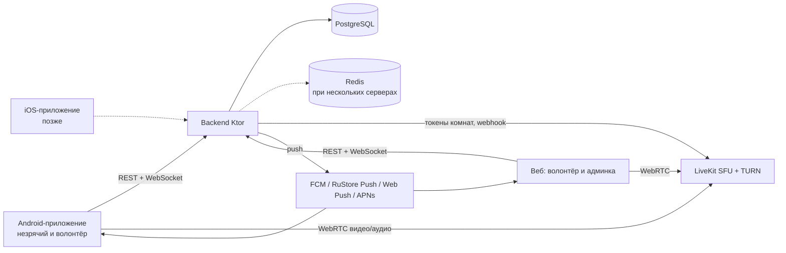
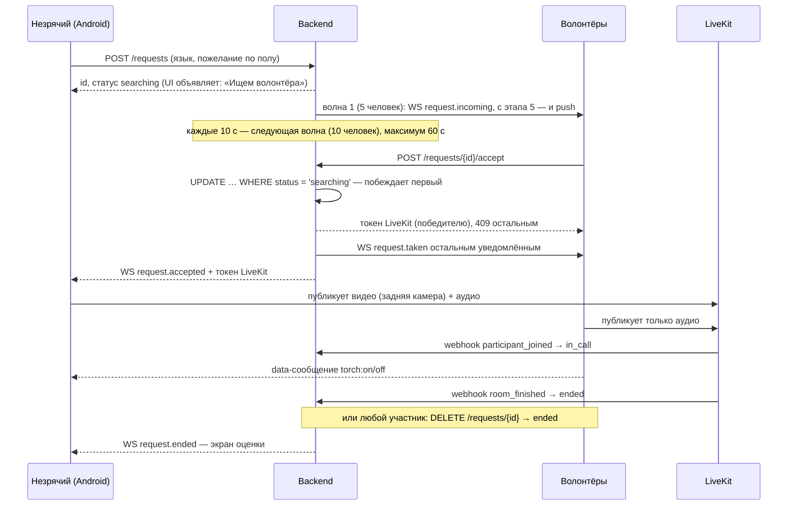

# Архитектура MVP «Рядом» — видеопомощь незрячим

> Рабочее название «Рядом» (пакет `ru.ryadom`) — заменить, когда появится финальное.
> Версия документа: 03.10.2026. Источник истины для разработки вместе с `docs/api/openapi.yaml`.

## 1. Ключевые решения

| Область | Решение | Почему |
|---|---|---|
| Мобильное приложение | Сейчас Android (Kotlin + Jetpack Compose); iOS (SwiftUI) — после отладки на Android | Kotlin — ваш язык; нативный UI лучше всего работает с TalkBack и VoiceOver |
| Общая логика | Модуль `shared` на Kotlin Multiplatform: API, WebSocket, авторизация, состояния запроса и звонка | При переносе на iOS заново пишутся только экраны и видеочасть |
| Бэкенд | Kotlin + Ktor | Один язык с Android, общий опыт |
| Веб | React + TypeScript (Vite): простая страница волонтёра и админка | Второй конец звонка для тестов; вход для волонтёров с iPhone до iOS-приложения |
| Видео | LiveKit (open-source SFU) на своём сервере, встроенный TURN | Нет зависимости от иностранных сервисов; SDK для Android, JS и Kotlin-сервера |
| База данных | PostgreSQL + Flyway-миграции | Надёжно и привычно |
| Очередь и блокировки | PostgreSQL + память backend; Redis — позже | «Кто первый принял звонок» — атомарный `UPDATE … WHERE status = 'searching'` в той же транзакции, что и остальные изменения; онлайн-статусы — открытые WebSocket в памяти (сервер backend один). Redis понадобится, когда серверов backend станет несколько (решено на этапе 2) |
| Push | FCM + RuStore Push (Android), Web Push (браузер), APNs + VoIP-push (iOS, позже) | Отправка через общий интерфейс — новый канал добавляется без изменения логики |
| Вход | Яндекс ID и VK ID (OAuth); вход по телефону — после появления юрлица | Не нужны договоры с SMS-провайдерами на старте |
| Языки | Русский и английский | Все строки только через ресурсы |
| Хостинг | Yandex Cloud, Docker Compose на 2 ВМ | Данные в РФ (152-ФЗ), просто для одного разработчика |
| Код | Открытый, монорепозиторий на GitHub + зеркало на GitFlic/GitVerse | Гранты, волонтёры-разработчики, защита от блокировок |
| Распространение | APK с сайта и RuStore; Google Play позже | Публикации пока нет — начинаем с APK |

## 2. Компоненты

Весь медиатрафик идёт через LiveKit на нашем сервере. Звонки не записываются.

## 3. Сценарий звонка

## 4. Подбор волонтёра

Кандидаты для запроса:

- роль «волонтёр», не заблокирован, уведомления включены;
- говорит на языке запроса;
- подходит по полу, если незрячий указал пожелание;
- по его часовому поясу сейчас 08:00–22:00 (или своё окно «не беспокоить»);
- не находится в звонке, ещё не получал вызов по этому запросу и не является его автором;
- очерёдность: кого дольше всего не беспокоили (последний вызов по любому запросу или конец его звонка), при равенстве — случайно.

Жёсткой паузы между вызовами одному волонтёру нет (решено на этапе 2). Пока волонтёров мало, пауза отсекала бы почти всех: в первой волне 5 человек, один принимает вызов, а остальные четверо выпадали бы на 10 минут, и повторный запрос незрячего не доходил бы ни до кого. Нагрузку распределяет очерёдность: недавно побеспокоенный волонтёр попадает в волну, только если остальных подходящих не хватает.

Волны: сразу 5 человек, далее каждые 10 секунд по 10, всего до 60 секунд. Если никто не принял, статус `no_answer`, незрячему объявляется «Сейчас никто не ответил, попробуйте ещё раз». Все параметры (размер волн, интервалы, окно) задаются в конфиге, а не в коде (`backend/src/main/resources/application.conf`, разделы `matching`, `requests`, `profile.defaultDoNotDisturb`).

Ограничения: у незрячего одновременно не больше одного активного запроса, у волонтёра — не больше одного звонка (гарантируют уникальные индексы в базе); частота запросов ограничена от злоупотреблений (по умолчанию 20 в час).

Как устроено (этап 2):

- правила отбора и очерёдность — чистая функция `VolunteerMatcher` с unit-тестами;
- волны отправляет `RequestDispatcher`: раз в секунду проверяет идущие поиски. Номер следующей волны хранится в базе (`help_requests.next_wave`), поэтому после перезапуска сервера поиск продолжается;
- до этапа 5 вызов доставляется только по WebSocket, поэтому кандидаты — волонтёры с открытым соединением; на этапе 5 добавятся те, у кого зарегистрирован push-токен;
- роль нельзя сменить, пока у пользователя есть активный запрос или идёт звонок (`PATCH /me` отвечает 409);
- страховка: звонок, о завершении которого LiveKit не сообщил, закрывается через 3 часа.

## 5. Модель данных

Данные о здоровье и инвалидности не собираются. Роль выбирает сам пользователь.
Схема создаётся миграциями Flyway (`backend/src/main/resources/db/migration`) по этапам: на этапе 1 — `users`, `auth_identities`, `refresh_tokens`; на этапе 2 — `help_requests`, `request_notifications`, `ratings`; остальные таблицы — в этапах, где они нужны.

| Таблица | Основные поля |
|---|---|
| `users` | id, role (`blind`/`volunteer`/`admin`; NULL — ещё не выбрана), display_name, languages[], gender (необязательно), gender_preference (для незрячего), timezone, dnd_from, dnd_to, notifications_enabled, banned_at, created_at |
| `auth_identities` | id, user_id, provider (`yandex`/`vk`/`dev`), subject, created_at |
| `devices` | id, user_id, push_provider (`fcm`/`rustore`/`webpush`/`apns`/`apns_voip`), token, platform, updated_at |
| `help_requests` | id, blind_user_id, language, gender_preference, status (`searching`/`accepted`/`in_call`/`ended`/`no_answer`/`cancelled`), accepted_by, next_wave, created_at, accepted_at, ended_at |
| `request_notifications` | request_id, volunteer_id, wave, sent_at, result (`accepted`/`too_late`; NULL — не ответил) |
| `ratings` | request_id, from_user_id, helped («помогло/не помогло» — проще всего с TalkBack), created_at. Без текстового комментария: в нём могли бы оказаться данные о здоровье; жалобы — в `reports` |
| `reports` | id, request_id, from_user_id, against_user_id, reason, text, status, resolved_by, created_at |
| `refresh_tokens` | id, user_id, token_hash (SHA-256, сам токен не хранится), created_at, expires_at, revoked_at |

## 6. API (кратко; полная версия — `docs/api/openapi.yaml`)

REST, JSON, авторизация по JWT (access 15 мин + refresh 90 дней с ротацией: повторное использование старого refresh-токена отзывает все сессии пользователя). Ошибки — в едином формате `{code, message}`: клиент показывает текст по `code` из своих ресурсов.

| Метод | Путь | Назначение |
|---|---|---|
| POST | `/auth/oauth/{provider}` | Вход через Яндекс ID / VK ID |
| POST | `/auth/dev` | Вход без OAuth — только в dev-окружении |
| POST | `/auth/refresh` | Обновление пары токенов (старый refresh-токен становится недействительным) |
| POST | `/auth/logout` | Выход на устройстве (отзыв refresh-токена) |
| GET / PATCH | `/me` | Профиль, роль, языки, пол, окно «не беспокоить» |
| POST | `/devices` | Регистрация push-токена |
| POST | `/requests` | Незрячий просит помощи |
| GET | `/requests/current` | Текущий активный запрос или звонок — восстановление после перезапуска приложения |
| GET | `/requests/{id}` | Состояние запроса — после переподключения WebSocket |
| DELETE | `/requests/{id}` | Незрячий отменяет поиск или завершает звонок; волонтёр завершает звонок (с этапа 3: иначе звонок, из которого ушёл только волонтёр, оставался бы открытым до выхода незрячего) |
| POST | `/requests/{id}/accept` | Волонтёр принимает; ответ — URL и токен LiveKit |
| POST | `/requests/{id}/rating` | Оценка после звонка: помогло / не помогло |
| POST | `/reports` | Жалоба |
| POST | `/webhooks/livekit` | События комнат от LiveKit |
| GET | `/admin/reports`, `/admin/metrics` | Админка |
| POST | `/admin/users/{id}/ban` | Блокировка |

WebSocket `/ws` — события: `request.incoming` (волонтёру — новый вызов), `request.accepted`, `request.no_answer`, `request.cancelled`, `request.taken` (для волонтёров, звонок уже принят), `request.ended` (звонок завершён). Каждое событие содержит актуальное состояние запроса. Вход — первым сообщением `{"type":"auth","accessToken":…}`, потому что браузер не передаёт заголовок `Authorization` при открытии WebSocket; после обновления токенов клиент присылает `auth` ещё раз. Пропущенные без соединения события не повторяются: клиент перечитывает состояние через `GET /requests/...`.

Совместимость версий. Сервер обновляется сразу, а приложения — когда пользователь поставит новый APK, поэтому старые версии работают долго. Отсюда правила:

- сервер строго проверяет тела запросов: неизвестное поле — ошибка 400, чтобы опечатки в клиенте были видны сразу;
- клиенты, наоборот, игнорируют неизвестные поля в ответах, неизвестные события WebSocket и неизвестные коды ошибок (показывают общее сообщение);
- поля в ответах только добавляются; поля запросов не удаляются и не переименовываются, новые поля запросов — необязательные;
- новое значение перечисления в ответе (статус, роль) старый клиент разобрать не сможет: сначала клиенты должны научиться пропускать неизвестные значения, иначе — новое поле.

## 7. Android-приложение

- Одно приложение, две роли; роль выбирается при первом входе.
- minSdk 26 (Android 8): у незрячих часто недорогие и не новые телефоны.
- Модули: `shared` (Kotlin Multiplatform — см. ниже), `android/app`, `feature-help` (незрячий), `feature-volunteer`, `feature-call` (LiveKit).
- `shared` содержит: модели API, клиент Ktor + WebSocket, хранение токенов через `expect/actual`, машину состояний запроса («поиск → принят → звонок → оценка»), коды ошибок. В `shared` запрещены зависимости от Android и от LiveKit: видео и UI остаются в платформенном коде.
- ViewModel Android только отображает состояния из `shared`; бизнес-логики в UI нет.
- Экран незрячего: одна большая кнопка на весь экран, вибрация и голосовые объявления при каждом изменении статуса.
- Звонок: foreground service (типы camera + microphone), экран не гаснет, задняя камера по умолчанию.
- Волонтёр: входящий вызов — high-priority push и полноэкранное уведомление в стиле звонка.
- Фонарик: команда от волонтёра через data-канал LiveKit. **Риск:** проверить на прототипе, что фонарик включается, пока камера захвачена LiveKit.

Правила доступности (обязательны для каждого экрана):

- у каждого интерактивного элемента есть осмысленное описание для TalkBack;
- зона нажатия не меньше 48×48 dp, основная кнопка — на весь экран;
- изменения статуса объявляются (`liveRegion` / announce), а не только показываются;
- поддержка крупного шрифта и высокой контрастности, без информации «только цветом»;
- логичный порядок фокуса, никаких таймаутов, требующих быстрой реакции.

## 8. Веб-приложение

Простое приложение без лишних функций: инструмент тестирования и вход для волонтёров с iPhone, пока нет iOS-версии.

- Волонтёр: вход, переключатель «готов помогать», входящие запросы (WebSocket, пока вкладка открыта, + Web Push), принятие, окно видео, кнопка фонарика, завершение, жалоба.
- Админ: жалобы, блокировки, метрики (время ответа, доля `no_answer`, число звонков и длительность по дням).
- Незрячих в веб-версии нет.
- На каждой странице — ссылка на исходный код (требование лицензии AGPL).

Как устроено (этап 3, код — `web/src`):

- Сайт и API на одном адресе: запросы идут на `/api/...`, в разработке их пересылает на backend Vite (`web/vite.config.ts`), на сервере — Caddy. Поэтому CORS не нужен.
- Модели API продублированы на TypeScript (`web/src/api/types.ts`, модуль `shared` из браузера не используется). Разбор ответов не ломается на новом сервере: неизвестные поля пропускаются, неизвестная роль или статус становятся `unknown`, неизвестные события WebSocket и коды ошибок — общий случай (раздел 6).
- Токены — в `localStorage`, общие для вкладок: вход переживает перезагрузку, а уведомление Web Push (этап 5) откроет сайт уже вошедшим. Обновление токенов — под блокировкой Web Locks, общей для всех вкладок: refresh-токен одноразовый, и два одновременных обновления сервер принял бы за кражу и отозвал бы все сеансы.
- WebSocket сам переподключается (паузы 1–30 с), до истечения access-токена присылает новый `auth`, а после каждого `ready` клиент перечитывает текущий звонок и входящие вызовы через REST.
- Логика кабинета волонтёра — чистая функция `volunteerReducer` с тестами; экраны только отображают её состояние. Звонок — интерфейс `CallSession`, реализация на LiveKit загружается только при первом звонке (самая большая часть сайта).
- Волонтёр завершает звонок сам (`DELETE /requests/{id}`), после звонка — вопрос «Удалось помочь?». Входящий вызов: звук (Web Audio), заголовок вкладки, срочное объявление для экранного диктора.
- «Готов помогать» — поле профиля `notificationsEnabled`. Время тишины показывается и меняется на главной странице; при выборе роли сохраняется часовой пояс браузера.
- Доступность: статусы объявляются через `aria-live`, при смене экрана фокус переходит на его заголовок, кнопки от 48 px, у состояний есть текст, а не только цвет, светлая и тёмная темы.
- Для разработки (`npm run dev`) — вход без OAuth и страница «тестовый незрячий»: создаёт запрос и публикует камеру компьютера, чтобы проверить звонок без Android-приложения. В боевую сборку не попадают (`config.devTools`).

## 9. Безопасность и персональные данные

- Все серверы и данные — в Yandex Cloud (РФ).
- Не храним: видео, аудио, данные о здоровье, точную геолокацию.
- Логи без персональных данных (только id).
- Токены LiveKit выдаются на одну комнату и живут не дольше 2 часов.
- Вход через Яндекс ID: веб получает код авторизации (с PKCE) и передаёт его серверу, сервер сам обменивает код на токен Яндекса. Android получает токен через Яндекс LoginSDK, сервер проверяет по `login.yandex.ru/info`, что токен выдан нашему `client_id` (иначе подошёл бы токен любого сайта с входом через Яндекс). От Яндекса сохраняются только id пользователя и имя; токены Яндекса не хранятся.
- Вход без OAuth (`POST /auth/dev`) включается только переменной `AUTH_DEV_ENABLED=true` — для разработки и тестов.
- Секреты — только в переменных окружения и секретах CI, никогда в репозитории.
- При регистрации — согласие на обработку ПДн и ссылка на политику.

## 10. Инфраструктура (Yandex Cloud)

| Ресурс | Что на нём | Примерно |
|---|---|---|
| ВМ 1: 2 vCPU / 4 ГБ | backend, PostgreSQL, Caddy (TLS) в Docker Compose | см. ниже |
| ВМ 2: 2–4 vCPU / 4 ГБ, публичный IP | LiveKit + встроенный TURN | см. ниже |
| Object Storage | резервные копии БД (ежедневно) | копейки |
| Container Registry | образы backend и web | копейки |

Ориентир — 8–15 тыс. ₽ в месяц на старте, нужно проверить калькулятором Yandex Cloud. Основная переменная статья — исходящий видеотрафик. При росте PostgreSQL переносится в Managed PostgreSQL.

События комнат (webhook) LiveKit с ВМ 2 отправляет в backend по внутренней сети Yandex Cloud; снаружи путь `/webhooks/*` закрыт в Caddy.

Локальная разработка — `infra/docker-compose.yml` (PostgreSQL и LiveKit в dev-режиме) на вашем компьютере. Backend запускается отдельно (`./gradlew :backend:run`): Gradle настраивает весь проект, включая `shared` с Android-таргетом, поэтому сборке нужен Android SDK, которого нет в Docker. Образ backend для сервера собирается из готовой сборки CI (`./gradlew :backend:installDist`, там SDK есть) поверх образа с JRE.

## 11. CI/CD (GitHub Actions)

- На каждый PR: тесты и линтеры backend (Gradle), Android (lint, unit, проверки доступности), web (lint, тесты), проверка `openapi.yaml` (Redocly) и сборка `shared` под iOS.
- На merge в `main`: подписанный APK как артефакт сборки (ключ — в секретах), Docker-образы в Yandex Container Registry, деплой на ВМ по SSH (`docker compose pull && up -d`).
- На merge в `main`: граф зависимостей Gradle для Dependabot (`.github/workflows/dependency-graph.yml`) — только то, что получают пользователи (backend, release APK, shared для iOS), без инструментов сборки и тестов. Автоматическая выгрузка GitHub («Automatic dependency submission») выключена. Dependabot только сообщает об уязвимостях; транзитивные зависимости Gradle исправляются вручную через BOM или ограничения версий в `libs.versions.toml`.
- Зеркалирование репозитория на GitFlic/GitVerse.

## 12. Тестирование

- Backend: unit-тесты; интеграционные тесты с Testcontainers (PostgreSQL); тесты подбора волонтёра с поддельными часами и поддельным push-отправщиком.
- Web: Vitest и Testing Library в jsdom с поддельными сервером, WebSocket и звонком (`web/src/testing`); экраны проверяются так, как их видит пользователь, — по ролям и подписям, включая объявления для экранного диктора. Видео и звук в jsdom не проверить — вручную: две вкладки (волонтёр и «тестовый незрячий» в окне инкогнито).
- Android: unit-тесты ViewModel, Compose UI-тесты, ручной чек-лист TalkBack перед каждой сборкой для тестировщиков. Автоматические проверки доступности:
  - с этапа 0 — в unit-тестах (Robolectric) каждого экрана вызывается `assertScreenIsAccessible()`: у интерактивных элементов есть описание для TalkBack и размер от 48 dp;
  - с этапа 4 — Accessibility Test Framework в UI-тестах на эмуляторе (контраст, порядок фокуса и др.). Под Robolectric ATF Compose-экраны не проверяет.
- Сквозной тест звонка: локальный docker-compose + эмулятор Android (незрячий) + браузер (волонтёр).
- Устройства: ваш Android-телефон + эмулятор с TalkBack; позже — недорогой телефон на Android 8–10.
- Незрячих тестировщиков пока нет — искать через ВОС и профильные сообщества параллельно с разработкой, к этапу 4.

## 13. Этапы разработки

Каждый этап — отдельная сессия Claude Code и отдельный PR с тестами.

| Этап | Результат |
|---|---|
| 0 | Монорепо, `docker-compose.yml`, скелеты backend/shared/android/web, CI, лицензия |
| 1 | Backend: пользователи, dev-вход, вход через Яндекс ID, миграции |
| 2 | Backend: запросы, подбор волонтёра, WebSocket, токены LiveKit, webhook |
| 3 | Веб волонтёра: вход, «готов помогать», принятие, видеозвонок |
| 4 | Android незрячего: вход, большая кнопка, поиск, звонок, оценка. **Первый сквозной звонок** |
| 5 | Push: FCM, RuStore, Web Push, волны уведомлений |
| 6 | Android волонтёра: входящий вызов, принятие |
| 7 | Фонарик, пожелание по полу, английский язык, VK ID |
| 8 | Жалобы, блокировки, админка, метрики |
| 9 | Развёртывание в Yandex Cloud, домен, TLS, автодеплой |
| 10 | Политика ПДн, онбординг, закрытая бета |
| 11 | Перенос на iOS: SwiftUI-экраны поверх `shared`, LiveKit Swift SDK, VoiceOver, CallKit + VoIP-push, APNs на сервере |
| 12 | Бета iOS через TestFlight, публикация в App Store |

До этапа 11 модуль `shared` проверяется сборкой под iOS-таргет в CI (без UI) на macOS-раннере GitHub Actions — для открытых репозиториев он бесплатный, — чтобы в `shared` случайно не попал Android-код.

### Отложенные задачи

То, что выяснилось на прошлых этапах и должно войти в будущие. Каждый этап — новая сессия Claude Code, поэтому такие задачи записываются здесь, а не только в отчёте об этапе. Выполненное — удалять.

- **Отдельный небольшой PR (до этапа 3 не сделан — сделать перед этапом 4).** Dependabot version updates: файл `.github/dependabot.yml` для экосистем `gradle` (Dependabot обновляет `gradle/libs.versions.toml` и Gradle Wrapper), `npm` (каталог `web/`) и `github-actions`. Обновления группами — один PR на экосистему раз в неделю или месяц, а не поток мелких PR; каждый PR проходит CI, вливает владелец. Зачем: уязвимости в инструментах сборки (плагины Android, Kotlin, Ktor, ktlint) исправляются только обновлением самих плагинов, а граф зависимостей их намеренно не включает (раздел 11). Dependabot security updates в настройках репозитория выключены: для транзитивных зависимостей Gradle они не создают PR, а только падают.
- **Этап 4.**
  - Ночью (22:00–08:00 по времени волонтёров) почти все волонтёры в режиме «не беспокоить», и запросы чаще заканчиваются `no_answer`. Текст для незрячего при `no_answer` должен это учитывать.
  - Волонтёр может завершить звонок сам (`DELETE /requests/{id}`, этап 3) — в том числе до того, как незрячий вошёл в комнату. Если `request.ended` пришёл раньше, чем звонок начался, незрячему лучше предложить попросить помощи снова, а не спрашивать оценку.
  - Если волонтёр пропал из комнаты LiveKit без завершения (закрыл вкладку, пропала сеть), приложение незрячего видит это по событию LiveKit: объявить голосом и предложить завершить звонок.
  - Проверить видео и звук веб-кабинета вживую: на этапе 3 сквозной звонок проверен в браузере без камеры и микрофона (комната LiveKit, статусы, завершение), сами видео и звук — нет.
- **Этап 5.**
  - Web Push для веб-кабинета: сейчас вызовы приходят, только пока вкладка открыта. Токены уже в `localStorage`, поэтому сайт, открытый из уведомления, будет вошедшим.
  - TypeScript 7: перейти, когда его поддержит typescript-eslint (версия 8.71 требует TypeScript ниже 6.1).
- **Этап 7.**
  - Кнопка фонарика в веб-кабинете (data-канал LiveKit, токен уже разрешает данные).
  - Языки волонтёра в веб-кабинете (сейчас их можно сменить только через `PATCH /me`); английский интерфейс уже есть.
- **Этап 8.**
  - Блокировка: сразу закрывать WebSocket пользователя (код `Realtime.CLOSE_BANNED`; сейчас соединение живёт до истечения access-токена, до 15 минут), отзывать его refresh-токены и завершать идущий звонок через серверный API LiveKit (сейчас `LiveKitService` сетевых запросов не делает). Новых вызовов заблокированный волонтёр уже не получает и принять запрос не может.
  - Назначение администратора — SQL-скриптом в `infra/`: через `PATCH /me` роль `admin` не выдаётся.
  - Веб: кнопка жалобы в звонке и после него; админка вместо заглушки «Админка появится позже».
- **Этап 9.**
  - Webhook LiveKit → backend по внутренней сети, Caddy не пропускает `/webhooks/*` снаружи (раздел 10).
  - Общий лимит размера тела запросов в Caddy: backend читает тело webhook целиком до проверки подписи.
  - Отдельный шаблон переменных окружения для сервера: `infra/.env.example` рассчитан на разработку (`AUTH_DEV_ENABLED=true`).
  - Образ backend: `./gradlew :backend:installDist` в CI и образ с JRE, Android SDK в Docker не нужен (раздел 10).
  - LiveKit: `use_external_ip: true` и адрес webhook для сервера (сейчас в `infra/livekit/livekit.yaml` — настройки для локальной разработки).
  - Веб на сервере: Caddy отдаёт `web/dist` и пересылает `/api/*` на backend, убирая `/api` из пути, включая WebSocket `/api/ws` (как `web/vite.config.ts` в разработке). Сайт по HTTPS может подключаться к LiveKit только по `wss://` — `LIVEKIT_URL` с TLS.
  - Сборка web: `VITE_YANDEX_CLIENT_ID` (см. `web/.env.example`), в настройках приложения Яндекс ID — Callback URI `https://<домен>/`. Заголовки безопасности в Caddy, в том числе Content-Security-Policy: токены хранятся в `localStorage`, поэтому на сайте не должно быть чужих скриптов.

## 14. Открытые вопросы

- ~~Лицензия~~ — решено на этапе 0: GNU AGPL-3.0 (или более поздняя версия) для всего репозитория. Следствия: в веб-приложении нужна ссылка на исходный код (раздел 13 AGPL); AGPL плохо совместима с условиями App Store — до этапа 11 решить, добавлять ли исключение для App Store (проще сделать, пока у кода один автор).
- Яндекс ID: сервер готов (этап 1), осталось зарегистрировать приложение на oauth.yandex.ru (тип «для авторизации пользователей», доступ `login:info`) и проверить условия для физлица. VK ID и RuStore — проверить до этапа 7.
- Нужно ли уведомление в РКН до появления юрлица и кто будет оператором ПДн.
- Название и домен.
- iOS: нужен Mac для сборки и аккаунт Apple Developer (99 $ в год); способ оплаты из России решить до этапа 11.
