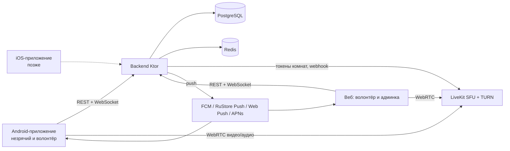
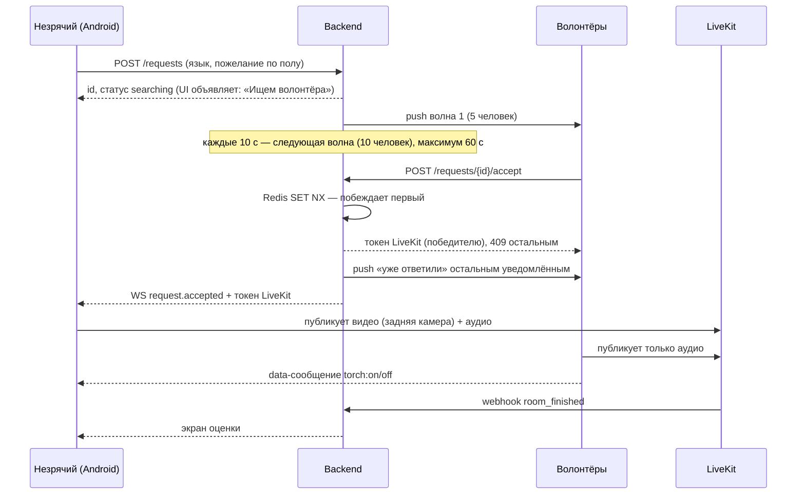

# Архитектура MVP «Рядом» — видеопомощь незрячим

> Рабочее название «Рядом» (пакет `ru.ryadom`) — заменить, когда появится финальное.
> Версия документа: 26.09.2026. Источник истины для разработки вместе с `docs/api/openapi.yaml`.

## 1. Ключевые решения

| Область | Решение | Почему |
|---|---|---|
| Мобильное приложение | Сейчас Android (Kotlin + Jetpack Compose); iOS (SwiftUI) — после отладки на Android | Kotlin — ваш язык; нативный UI лучше всего работает с TalkBack и VoiceOver |
| Общая логика | Модуль `shared` на Kotlin Multiplatform: API, WebSocket, авторизация, состояния запроса и звонка | При переносе на iOS заново пишутся только экраны и видеочасть |
| Бэкенд | Kotlin + Ktor | Один язык с Android, общий опыт |
| Веб | React + TypeScript (Vite): простая страница волонтёра и админка | Второй конец звонка для тестов; вход для волонтёров с iPhone до iOS-приложения |
| Видео | LiveKit (open-source SFU) на своём сервере, встроенный TURN | Нет зависимости от иностранных сервисов; SDK для Android, JS и Kotlin-сервера |
| База данных | PostgreSQL + Flyway-миграции | Надёжно и привычно |
| Очередь и блокировки | Redis | Атомарный «кто первый принял звонок», онлайн-статусы |
| Push | FCM + RuStore Push (Android), Web Push (браузер), APNs + VoIP-push (iOS, позже) | Отправка через общий интерфейс — новый канал добавляется без изменения логики |
| Вход | Яндекс ID и VK ID (OAuth); вход по телефону — после появления юрлица | Не нужны договоры с SMS-провайдерами на старте |
| Языки | Русский и английский | Все строки только через ресурсы |
| Хостинг | Yandex Cloud, Docker Compose на 2 ВМ | Данные в РФ (152-ФЗ), просто для одного разработчика |
| Код | Открытый, монорепозиторий на GitHub + зеркало на GitFlic/GitVerse | Гранты, волонтёры-разработчики, защита от блокировок |
| Распространение | APK с сайта и RuStore; Google Play позже | Публикации пока нет — начинаем с APK |

## 2. Компоненты

Весь медиатрафик идёт через LiveKit на нашем сервере. Звонки не записываются.

## 3. Сценарий звонка

## 4. Подбор волонтёра

Кандидаты для запроса:

- роль «волонтёр», не заблокирован, уведомления включены;
- говорит на языке запроса;
- подходит по полу, если незрячий указал пожелание;
- по его часовому поясу сейчас 08:00–22:00 (или своё окно «не беспокоить»);
- не находится в звонке и не получал уведомлений последние 10 минут;
- сортировка: кого дольше всего не беспокоили, при равенстве — случайно.

Волны: сразу 5 человек, далее каждые 10 секунд по 10, всего до 60 секунд. Если никто не принял, статус `no_answer`, незрячему объявляется «Сейчас никто не ответил, попробуйте ещё раз». Все параметры (размер волн, интервалы, окно) задаются в конфиге, а не в коде.

Ограничения: у незрячего одновременно не больше одного активного запроса; частота запросов ограничена от злоупотреблений.

## 5. Модель данных

Данные о здоровье и инвалидности не собираются. Роль выбирает сам пользователь.

| Таблица | Основные поля |
|---|---|
| `users` | id, role (`blind`/`volunteer`/`admin`), display_name, languages[], gender (необязательно), gender_preference (для незрячего), timezone, dnd_from, dnd_to, notifications_enabled, banned_at, created_at |
| `auth_identities` | id, user_id, provider (`yandex`/`vk`/`dev`), subject, created_at |
| `devices` | id, user_id, push_provider (`fcm`/`rustore`/`webpush`/`apns`/`apns_voip`), token, platform, updated_at |
| `help_requests` | id, blind_user_id, language, gender_preference, status (`searching`/`accepted`/`in_call`/`ended`/`no_answer`/`cancelled`), accepted_by, created_at, accepted_at, ended_at |
| `request_notifications` | request_id, volunteer_id, wave, sent_at, result (`accepted`/`too_late`/`ignored`) |
| `ratings` | request_id, from_user_id, score (1–5 или «помогло/не помогло»), comment |
| `reports` | id, request_id, from_user_id, against_user_id, reason, text, status, resolved_by, created_at |
| `refresh_tokens` | id, user_id, hash, expires_at, revoked_at |

## 6. API (кратко; полная версия — `docs/api/openapi.yaml`)

REST, JSON, авторизация по JWT (access 15 мин + refresh).

| Метод | Путь | Назначение |
|---|---|---|
| POST | `/auth/oauth/{provider}` | Вход через Яндекс ID / VK ID |
| POST | `/auth/dev` | Вход без OAuth — только в dev-окружении |
| POST | `/auth/refresh` | Обновление токена |
| GET / PATCH | `/me` | Профиль, роль, языки, пол, окно «не беспокоить» |
| POST | `/devices` | Регистрация push-токена |
| POST | `/requests` | Незрячий просит помощи |
| DELETE | `/requests/{id}` | Отмена |
| POST | `/requests/{id}/accept` | Волонтёр принимает; ответ — URL и токен LiveKit |
| POST | `/requests/{id}/rating` | Оценка после звонка |
| POST | `/reports` | Жалоба |
| POST | `/webhooks/livekit` | События комнат от LiveKit |
| GET | `/admin/reports`, `/admin/metrics` | Админка |
| POST | `/admin/users/{id}/ban` | Блокировка |

WebSocket `/ws` — события: `request.accepted`, `request.no_answer`, `request.cancelled`, `request.taken` (для волонтёров, звонок уже принят).

## 7. Android-приложение

- Одно приложение, две роли; роль выбирается при первом входе.
- minSdk 26 (Android 8): у незрячих часто недорогие и не новые телефоны.
- Модули: `shared` (Kotlin Multiplatform — см. ниже), `android/app`, `feature-help` (незрячий), `feature-volunteer`, `feature-call` (LiveKit).
- `shared` содержит: модели API, клиент Ktor + WebSocket, хранение токенов через `expect/actual`, машину состояний запроса («поиск → принят → звонок → оценка»), коды ошибок. В `shared` запрещены зависимости от Android и от LiveKit: видео и UI остаются в платформенном коде.
- ViewModel Android только отображает состояния из `shared`; бизнес-логики в UI нет.
- Экран незрячего: одна большая кнопка на весь экран, вибрация и голосовые объявления при каждом изменении статуса.
- Звонок: foreground service (типы camera + microphone), экран не гаснет, задняя камера по умолчанию.
- Волонтёр: входящий вызов — high-priority push и полноэкранное уведомление в стиле звонка.
- Фонарик: команда от волонтёра через data-канал LiveKit. **Риск:** проверить на прототипе, что фонарик включается, пока камера захвачена LiveKit.

Правила доступности (обязательны для каждого экрана):

- у каждого интерактивного элемента есть осмысленное описание для TalkBack;
- зона нажатия не меньше 48×48 dp, основная кнопка — на весь экран;
- изменения статуса объявляются (`liveRegion` / announce), а не только показываются;
- поддержка крупного шрифта и высокой контрастности, без информации «только цветом»;
- логичный порядок фокуса, никаких таймаутов, требующих быстрой реакции.

## 8. Веб-приложение

Простое приложение без лишних функций: инструмент тестирования и вход для волонтёров с iPhone, пока нет iOS-версии.

- Волонтёр: вход, переключатель «готов помогать», входящие запросы (WebSocket, пока вкладка открыта, + Web Push), принятие, окно видео, кнопка фонарика, завершение, жалоба.
- Админ: жалобы, блокировки, метрики (время ответа, доля `no_answer`, число звонков и длительность по дням).
- Незрячих в веб-версии нет.

## 9. Безопасность и персональные данные

- Все серверы и данные — в Yandex Cloud (РФ).
- Не храним: видео, аудио, данные о здоровье, точную геолокацию.
- Логи без персональных данных (только id).
- Токены LiveKit выдаются на одну комнату и живут не дольше 2 часов.
- Секреты — только в переменных окружения и секретах CI, никогда в репозитории.
- При регистрации — согласие на обработку ПДн и ссылка на политику.

## 10. Инфраструктура (Yandex Cloud)

| Ресурс | Что на нём | Примерно |
|---|---|---|
| ВМ 1: 2 vCPU / 4 ГБ | backend, PostgreSQL, Redis, Caddy (TLS) в Docker Compose | см. ниже |
| ВМ 2: 2–4 vCPU / 4 ГБ, публичный IP | LiveKit + встроенный TURN | см. ниже |
| Object Storage | резервные копии БД (ежедневно) | копейки |
| Container Registry | образы backend и web | копейки |

Ориентир — 8–15 тыс. ₽ в месяц на старте, нужно проверить калькулятором Yandex Cloud. Основная переменная статья — исходящий видеотрафик. При росте PostgreSQL переносится в Managed PostgreSQL.

Локальная разработка — тот же `docker-compose.yml` (PostgreSQL, Redis, LiveKit в dev-режиме) на вашем компьютере.

## 11. CI/CD (GitHub Actions)

- На каждый PR: тесты и линтеры backend (Gradle), Android (lint, unit, проверки доступности), web (lint, тесты).
- На merge в `main`: подписанный APK как артефакт сборки (ключ — в секретах), Docker-образы в Yandex Container Registry, деплой на ВМ по SSH (`docker compose pull && up -d`).
- Зеркалирование репозитория на GitFlic/GitVerse.

## 12. Тестирование

- Backend: unit-тесты; интеграционные тесты с Testcontainers (PostgreSQL, Redis); тесты подбора волонтёра с поддельными часами и поддельным push-отправщиком.
- Android: unit-тесты ViewModel, Compose UI-тесты, автоматические проверки доступности (Accessibility Test Framework), ручной чек-лист TalkBack перед каждой сборкой для тестировщиков.
- Сквозной тест звонка: локальный docker-compose + эмулятор Android (незрячий) + браузер (волонтёр).
- Устройства: ваш Android-телефон + эмулятор с TalkBack; позже — недорогой телефон на Android 8–10.
- Незрячих тестировщиков пока нет — искать через ВОС и профильные сообщества параллельно с разработкой, к этапу 4.

## 13. Этапы разработки

Каждый этап — отдельная сессия Claude Code и отдельный PR с тестами.

| Этап | Результат |
|---|---|
| 0 | Монорепо, `docker-compose.yml`, скелеты backend/shared/android/web, CI, лицензия |
| 1 | Backend: пользователи, dev-вход, вход через Яндекс ID, миграции |
| 2 | Backend: запросы, подбор волонтёра, WebSocket, токены LiveKit, webhook |
| 3 | Веб волонтёра: вход, «готов помогать», принятие, видеозвонок |
| 4 | Android незрячего: вход, большая кнопка, поиск, звонок, оценка. **Первый сквозной звонок** |
| 5 | Push: FCM, RuStore, Web Push, волны уведомлений |
| 6 | Android волонтёра: входящий вызов, принятие |
| 7 | Фонарик, пожелание по полу, английский язык, VK ID |
| 8 | Жалобы, блокировки, админка, метрики |
| 9 | Развёртывание в Yandex Cloud, домен, TLS, автодеплой |
| 10 | Политика ПДн, онбординг, закрытая бета |
| 11 | Перенос на iOS: SwiftUI-экраны поверх `shared`, LiveKit Swift SDK, VoiceOver, CallKit + VoIP-push, APNs на сервере |
| 12 | Бета iOS через TestFlight, публикация в App Store |

До этапа 11 модуль `shared` проверяется сборкой под iOS-таргет в CI (без UI) на macOS-раннере GitHub Actions — для открытых репозиториев он бесплатный, — чтобы в `shared` случайно не попал Android-код.

## 14. Открытые вопросы

- Лицензия: Apache-2.0 (проще) или AGPL-3.0 (не даст сделать закрытый форк сервера). Рекомендация — AGPL-3.0 для сервера.
- Условия подключения Яндекс ID, VK ID и RuStore для физлица — проверить до этапов 1 и 7.
- Нужно ли уведомление в РКН до появления юрлица и кто будет оператором ПДн.
- Название и домен.
- iOS: нужен Mac для сборки и аккаунт Apple Developer (99 $ в год); способ оплаты из России решить до этапа 11.
